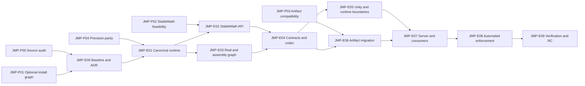

# Jitter Physics Baker — декомпозиция миграции math и precision contract

Статус: **рабочий backlog; реализация не начата**.

Обновлено: 2026-09-01.

Источник требований: промт о переходе с `PhysicsVector3`/`PhysicsQuaternion` и прямых
`float`/`double` на `JVector`, `JQuaternion`, source-level alias `Real` и публичный
`Jitter2.LinearMath.StableMath`.

Связанные документы:

- [JITTER_PHYSICS_PACKAGE_SPEC.md](JITTER_PHYSICS_PACKAGE_SPEC.md) — действующее ТЗ пакета;
- [JITTER_PHYSICS_PACKAGE_DECOMPOSITION.md](JITTER_PHYSICS_PACKAGE_DECOMPOSITION.md) —
  историческая общая декомпозиция;
- [MANUAL_TEST_PLAN.md](MANUAL_TEST_PLAN.md) — ручные Unity-проверки.

Документ описывает будущую работу в иерархии `Program → Proto/Epic → Task → Subtask`.
Он не меняет статусы общей декомпозиции и не является доказательством реализации.

## 1. Цель программы

Перевести authoritative physics contracts и simulation-affecting вычисления на единую
математическую модель Jitter:

- `JVector` вместо `PhysicsVector3`;
- `JQuaternion` вместо `PhysicsQuaternion`;
- compile-time alias `Real` вместо прямых `float`/`double` в simulation data;
- публичный supported API `Jitter2.LinearMath.StableMath` вместо `Mathf`, `MathF` и
  `System.Math` в deterministic-коде;
- Unity-типы только на authoring/editor/presentation boundary;
- production precision profile `f32`;
- deterministic artifact bytes либо явная новая schema и migration path;
- один и тот же проверенный Jitter runtime на Unity-клиенте и dedicated server.

Результат программы — полностью проверенный release candidate. Push, tag и публикация
не входят в программу без отдельного явного подтверждения пользователя.

## 2. Обязательный инвариант: Jitter устанавливается отдельно

Текущая модель интеграции сохраняется как жёсткое ограничение программы:

1. Базовый UPM package должен импортироваться в Unity-проект без `Jitter2.Core`.
2. `Jitter2~` остаётся dormant source/prebuilt snapshot и не компилируется Unity напрямую.
3. `JitterIntegration~` остаётся dormant и активируется только явным Setup-действием.
4. Если совместимый `Jitter2.Core` уже есть у consumer-а, installer не копирует и не
   модифицирует его, а ставит только integration layer.
5. Если Jitter отсутствует, пользователь отдельно запускает установку package-owned Jitter
   и integration layer; импорт пакета сам по себе ничего не записывает.
6. Receipt продолжает определять ownership, update и removal package-owned файлов.
7. Внешний Jitter неприкосновенен; modified/unowned файлы не перезаписываются.
8. В проекте и в итоговой сборке допускается ровно одна assembly `Jitter2.Core`.
9. Обязательная зависимость базового `package.json` на отдельный Jitter UPM package не
   вводится этой программой.
10. Никаких мутаций из `[InitializeOnLoad]`, import hook или отрисовки окна.

Это уточнение имеет приоритет над рекомендацией исходного промта публиковать Jitter как
обязательный отдельный UPM runtime package. Каноничность обеспечивается pinned snapshot,
lock/receipt, compile-profile identity и фактическим DLL SHA-256, но установка остаётся
отдельным явным действием пользователя.

## 3. Проверенная исходная точка

На момент создания документа подтверждена следующая baseline-информация:

| Параметр | Значение |
|---|---|
| Ветка | `feat/d.islamov/jitter_physics_baker_ux` |
| Source HEAD | `b8f622a` |
| Source package | `0.0.12` |
| Published package/tag | `v0.0.12`, package commit `1bb0f70` |
| Artifact schema | `1` |
| Assembly name | `Jitter2.Core` |
| Production precision | `f32` |
| Jitter installation | отдельное explicit Setup-действие |

Эта таблица — контекст планирования, а не будущий baseline evidence. Перед реализацией
`JMP-T00.1` обязан снять состояние заново.

В checkout уже есть unrelated untracked-документы. Они не относятся к программе и не
должны изменяться, удаляться или попадать в staging. Запрещены `git add -A`, `git reset`
и destructive cleanup.

## 4. Иерархия, статусы и приоритеты

```text
Program JMP
├── Proto JMP-Pxx
└── Epic JMP-Exx
    └── Task JMP-Txx.y
        └── Subtask
```

- **Proto** — ограниченная проверка рискованного решения до production-изменений.
- **Epic** — законченный архитектурный или пользовательский результат.
- **Task** — независимо проверяемая порция работы для отдельного review/commit.
- **Subtask** — конкретное действие, тест или артефакт внутри Task.
- **Gate** — проверка со статусом `PASS`, `FAIL`, `BLOCKED` или `NOT RUN`.

Приоритеты:

- `P0` — блокирует безопасное начало миграции;
- `P1` — обязателен для release candidate;
- `P2` — post-release улучшение, не подменяющее P0/P1 gate.

Task считается выполненной только после выполнения subtasks, acceptance criteria и
сохранения evidence. Документация или успешная компиляция одного проекта не доказывают
Unity, IL2CPP, server либо consumer gate.

## 5. Неподлежащие нарушению правила реализации

1. Jitter и integration устанавливаются отдельно, как описано в разделе 2.
2. `Real` остаётся compile-time alias, а не новым scalar wrapper:

   ```csharp
   #if USE_DOUBLE_PRECISION
   global using Real = System.Double;
   #else
   global using Real = System.Single;
   #endif
   ```

3. Нельзя вводить `JReal`, `DeterministicFloat`, `FixedReal` или аналогичный тип.
4. Production profile остаётся `f32`; неподдержанный `f64` завершается fail-fast.
5. Каждая отдельно компилируемая Jitter-dependent assembly получает direct reference на
   единственную `Jitter2.Core` и тот же `Real` profile.
6. `UnityEngine.Vector3`, `Quaternion`, `Bounds` и `Matrix4x4` не хранятся в authoritative
   artifact/runtime records.
7. Unity value преобразуется в Jitter value один раз в явном boundary adapter-е.
8. Telemetry `double` не участвует в artifact, fingerprint, simulation или network state.
9. Формат artifact меняется только вместе с явным schema decision.
10. Изменение Jitter source/profile/hash честно меняет compatibility identity.
11. Ошибка чтения или применения fail-fast и не оставляет частично готовый мир.
12. Внешний Jitter и unrelated user work не мутируются.

## 6. Блокирующий архитектурный конфликт

Текущий package contract требует, чтобы `Contracts`, `ArtifactCodec`, `UnityArtifact`,
`Authoring` и базовый `Editor` импортировались без Jitter dependency. Новый math contract
требует `JVector`/`JQuaternion` в records и direct reference на `Jitter2.Core`.

Прямое добавление ссылки в существующий always-compiled `Contracts.asmdef` запрещено:
чистый проект без Jitter перестанет импортировать пакет до запуска installer-а.

До production-миграции должен быть принят `JMP-ADR-001`. Он обязан сохранить отдельную
установку Jitter и выбрать проверенную assembly-модель. Предпочтительный кандидат для Proto:

- always-available bootstrap/authoring shell остаётся Jitter-free;
- Jitter-dependent contracts, codec, bake/runtime adapter и integration sources хранятся в
  dormant `~`-слое;
- explicit Setup атомарно материализует их вместе с direct references после выбора одного
  совместимого `Jitter2.Core`;
- removal/update выполняются только по receipt и не затрагивают external Jitter;
- dedicated server получает те же Jitter-dependent sources и exact same Jitter DLL bytes
  через explicit projection/export.

Допускается другое решение, только если оно одновременно доказывает clean import без Jitter,
явную отдельную установку, отсутствие второй `Jitter2.Core`, direct references и server
binary parity. Если такого решения нет, программа останавливается после `JMP-P01`.

## 7. Карта зависимостей



Критический путь:

```text
P00/P01/P02/P03/P04 → E00 → E01/E02/E03 → E04 → E05/E06 → E07 → E08 → E09
```

## 8. Proto backlog

### JMP-P00. Исполняемый source audit и classifier

Приоритет: P0.

Статус: выполнен в `JMP-E00`; baseline hash и regression command зафиксированы.

Цель: получить полный machine-readable inventory до правок.

Subtasks:

- [x] Найти `PhysicsVector3`, `PhysicsQuaternion`, `float`, `double`, `Mathf`, `MathF` и
  `System.Math` в `Runtime`, `Editor`, `Authoring`, `JitterIntegration~`, `Server~`,
  `Samples~` и `Tests`.
- [x] Классифицировать каждое совпадение как simulation, serialization, telemetry,
  Unity boundary, test fixture либо third-party/vendor.
- [x] Зафиксировать owner, path, symbol, reason и целевое действие.
- [x] Создать proposed allowlist schema с обязательным reason.
- [x] Добавить временную запрещённую строку в disposable worktree и доказать, что будущий
  audit её ловит; удалить только тестовое изменение.
- [x] Сохранить baseline counts по каждой категории.

Результаты: audit inventory, classifier rules, allowlist draft, список спорных мест.

Критерий выхода: каждое использование классифицировано; необъяснённых suppressions нет.

### JMP-P01. Clean import и отдельно устанавливаемый Jitter-dependent graph

Приоритет: P0, блокирует `JMP-E03` и `JMP-E04`.

Статус: `BLOCKED`; static graph и ADR готовы, fresh Unity consumer не запущен из-за licensing
handshake `505 Unsupported protocol version '1.18.1'`.

Цель: доказать возможность использовать Jitter math types, не превращая Jitter в
обязательную зависимость базового импорта.

Subtasks:

- [ ] Создать disposable clean Unity consumer без `Jitter2.Core`.
- [ ] Импортировать exact package revision и подтвердить отсутствие compile errors.
- [x] Спроектировать границу always-available и dormant/installable assemblies.
- [x] Проверить, какие contracts/API доступны до Setup и какие только после него.
- [ ] Установить package-owned Jitter отдельной explicit command.
- [ ] Установить Jitter-dependent layer второй явной операцией либо одной составной
  подтверждённой Setup-командой.
- [x] Проверить direct references каждого установленного asmdef.
- [ ] Повторить сценарий с одним совместимым external `Jitter2.Core`; доказать, что он не
  копируется и не изменяется.
- [ ] Проверить missing, duplicate, incompatible, modified receipt и unowned conflict cases.
- [ ] Проверить safe update/removal только package-owned файлов.
- [x] Зафиксировать выбранную модель в input для `JMP-ADR-001`.

Критерий выхода: clean import без Jitter и работа после explicit Setup доказаны одним
prototype; в обоих сценариях существует ровно одна `Jitter2.Core`.

### JMP-P02. StableMath determinism feasibility

Приоритет: P0.

Статус: portable prototype выполнен; Unity Editor/IL2CPP runtime evidence заблокирован.

Subtasks:

- [x] Зафиксировать current implementation и consumer-only patches `StableMath`.
- [x] Определить required API: constants, trig, `Abs`, `Min`, `Max`, `Clamp`, `Clamp01`,
  `Sqrt`/inverse-length, `Lerp`, rounding и quantization.
- [x] Определить valid domain, NaN/Infinity policy, `-0` policy и error bounds.
- [x] Создать bit-pattern fixtures для halfway, near-zero, subnormal, quadrant boundaries,
  gameplay ranges и invalid inputs.
- [ ] Прогнать feasibility на поддерживаемых .NET runtime и Unity Editor.
- [x] Отдельно определить, что потребует IL2CPP evidence.

Критерий выхода: нет обязательного метода, зависящего от platform libm без принятого
determinism contract.

### JMP-P03. Artifact byte compatibility

Приоритет: P0.

Статус: portable byte/layout decision выполнен; Unity `.physics.asset`/repeat-bake blocked.

Subtasks:

- [ ] Сохранить v0.0.12 golden payload, manifest и `.physics.asset` fixture.
- [x] Записать текущие schema, hash и `runtimeCompatibilityId`.
- [ ] Реализовать prototype нового codec только в disposable branch/worktree.
- [ ] Сравнить old/new bytes и найти первый отличающийся offset.
- [x] Проверить `WriteReal/ReadReal`, `WriteJVector/ReadJVector` и
  `WriteJQuaternion/ReadJQuaternion` для `f32`.
- [x] Определить, сохраняется schema 1 или требуется новая schema/legacy reader.
- [x] Зафиксировать обязательность re-bake при новом Jitter source hash.

Критерий выхода: есть byte-level evidence и input для `JMP-ADR-002`; изменение bytes без
schema decision запрещено.

### JMP-P04. Precision, layout и Unity/server parity

Приоритет: P0.

Статус: portable precision/layout/parity prototype выполнен; installed Unity plugin fixtures
blocked.

Subtasks:

- [x] Проверить `Precision.IsDoublePrecision == false` для production build.
- [x] Зафиксировать `sizeof/layout` `Real`, `JVector` и `JQuaternion`.
- [x] Зафиксировать source hash, compile profile id и DLL SHA-256.
- [ ] Доказать, что installed Unity plugin и server reference используют одинаковые bytes.
- [ ] Создать tampered DLL, duplicate DLL и `f64` negative fixtures.
- [x] Проверить, что mismatch блокирует bake/startup до изменения мира.

Критерий выхода: production `f32` и binary parity проверяются автоматически, а не по имени
assembly, timestamp или успешной Console.

## JMP-E00. Baseline, решения и evidence contract

Приоритет: P0.

Статус: `BLOCKED` внешним Unity Licensing Client; следующий epic не начинать.

Результат: архитектура согласована до изменения Jitter sources и contracts.

### JMP-T00.1. Снять воспроизводимый baseline

Subtasks:

- [x] Записать `git status --short`, branch, HEAD и remote state.
- [x] Сверить `package.json`, `JitterPhysicsPackage.PackageVersion` и changelog.
- [x] Сверить `jitter2.lock.json`, patch set, precision и source hash.
- [x] Инвентаризировать все asmdef/csproj и direct/transitive Jitter references.
- [x] Инвентаризировать все source/precompiled candidates `Jitter2.Core`.
- [x] Запустить четыре обязательные repository checks и сохранить outputs.
- [x] Запустить Unity EditMode/PlayMode baseline либо отметить точный blocker.
- [x] Зафиксировать unrelated dirty/untracked files.

Acceptance criteria:

- [x] Baseline report содержит команды, exit codes, test counts и paths к XML.
- [x] Ни один source/asset не изменён ради baseline.

### JMP-T00.2. Принять `JMP-ADR-001` — optional Jitter dependency model

Subtasks:

- [x] Описать current explicit Setup flow и ownership receipt.
- [x] Описать выбранную always-available/installable assembly boundary.
- [x] Объяснить clean import до Jitter installation.
- [x] Определить direct-reference strategy после установки.
- [x] Определить external Jitter trust и duplicate policy.
- [x] Определить server projection exact-DLL strategy.
- [x] Определить update, rollback и removal.
- [x] Записать rejected alternatives, включая mandatory Jitter UPM dependency.

Acceptance criteria:

- [x] ADR не отменяет отдельную установку Jitter.
- [ ] ADR подтверждён результатом `JMP-P01`, а не только текстом.

### JMP-T00.3. Принять `JMP-ADR-002` — artifact compatibility

Subtasks:

- [x] Записать byte comparison `JMP-P03`.
- [x] Решить schema retain/bump.
- [x] Решить legacy reader versus explicit migration error.
- [x] Зафиксировать re-bake/re-export requirement.
- [x] Зафиксировать compatibility identity при изменении Jitter source hash.
- [x] Описать atomic payload/manifest/asset delivery.

Acceptance criteria:

- [x] Ни один старый artifact не принимается под новой semantics молча.

### JMP-T00.4. Создать evidence matrix

Subtasks:

- [x] Создать строки для всех 14 обязательных gates.
- [x] Для каждого gate определить command, expected output и evidence path.
- [x] Запретить агрегированный PASS при `NOT RUN` дочернем gate.
- [x] Отдельно учитывать Editor compile, EditMode, PlayMode, IL2CPP и manual behavior.

Epic acceptance:

- [ ] Все пять Proto завершены.
- [x] Оба ADR приняты.
- [x] Архитектурных P0 unknowns не осталось.

## JMP-E01. Канонический Jitter runtime при прежнем Setup flow

Приоритет: P0.

Результат: pinned Jitter snapshot/prebuilt остаётся dormant, устанавливается отдельно и
одинаково идентифицируется Unity и server.

### JMP-T01.1. Обновить canonical Jitter sources

Subtasks:

- [ ] Зафиксировать upstream commit и полный included/excluded source set.
- [ ] Перенести только подтверждённый consumer `StableMath` patch.
- [ ] Обновить `PATCHES.md` с reason для каждого отклонения.
- [ ] Проверить отсутствие случайных generated/vendor файлов.
- [ ] Не менять external consumer copy напрямую.

### JMP-T01.2. Сделать build identity воспроизводимой

Subtasks:

- [ ] Канонизировать compile profile JSON.
- [ ] Зафиксировать target framework, unsafe, defines, intrinsics и polyfills.
- [ ] Выполнить два clean builds из одного source tree.
- [ ] Сравнить SHA-256 `Jitter2.Core.dll`, Unsafe dependency и XML docs.
- [ ] Разделить deterministic binary requirement и допустимые PE metadata differences;
  если byte identity невозможна, принять проверяемую reproducibility policy.

### JMP-T01.3. Обновить lock и provenance

Subtasks:

- [ ] Обновить source content hash.
- [ ] Повысить `patchSetId`.
- [ ] Обновить compile profile id.
- [ ] Записать Jitter DLL SHA-256 и dependency hashes.
- [ ] Обновить prebuilt DLL только через documented build tool.
- [ ] Добавить verifier source/profile/binary consistency.

### JMP-T01.4. Сохранить отдельную установку

Subtasks:

- [ ] Не добавлять mandatory Jitter dependency в base `package.json`.
- [ ] Сохранить no-write package import.
- [ ] Устанавливать package-owned Jitter только explicit action.
- [ ] Устанавливать integration layer только после успешного compatibility check.
- [ ] Обновить receipt expected hashes и ownership.
- [ ] Не перезаписывать compatible external Jitter.
- [ ] Блокировать duplicate/incompatible/unowned conflicts.

### JMP-T01.5. Обеспечить exact server runtime

Subtasks:

- [ ] Запретить независимую server-компиляцию с иным profile.
- [ ] Проецировать/копировать exact verified DLL bytes явной командой.
- [ ] Проверять SHA-256 после materialization и перед server startup.
- [ ] Не использовать Unity `Library/PackageCache` как production dependency.
- [ ] Добавить negative test для stale/tampered server DLL.

Epic acceptance:

- [ ] Clean import без Jitter сохранён.
- [ ] Separate Setup устанавливает ровно одну проверенную `Jitter2.Core`.
- [ ] Unity и server DLL hashes равны.

## JMP-E02. Публичный supported `StableMath`

Приоритет: P0.

### JMP-T02.1. Зафиксировать API contract

Subtasks:

- [ ] Сделать inventory существующих constants/methods.
- [ ] Для каждого API записать domain, exceptional inputs, `-0`, error bound и determinism.
- [ ] Определить supported surface и XML-doc на английском.
- [ ] Запретить consumer-local дубликаты.

### JMP-T02.2. Расширить canonical implementation

Subtasks:

- [ ] Сделать `StableMath` public.
- [ ] Сделать public `Pi`, `HalfPi`, `QuarterPi`, `TwoPi`.
- [ ] Сделать public `Sin`, `Cos`, `SinCos`, `Atan2`, `Asin`, `Acos`.
- [ ] Добавить `Abs`, `Min`, `Max`, `Clamp`, `Clamp01`.
- [ ] Добавить deterministic `Sqrt` либо documented inverse-length path.
- [ ] Добавить `Lerp`.
- [ ] Добавить rounding/quantization с `MidpointRounding.AwayFromZero` semantics.
- [ ] Не реализовывать determinism-critical API пустыми wrappers над platform libm.

### JMP-T02.3. Добавить API и bit-pattern tests

Subtasks:

- [ ] Проверить public surface и signatures.
- [ ] Добавить golden bits для positive/negative zero.
- [ ] Добавить positive/negative halfway fixtures.
- [ ] Добавить near-zero/subnormal fixtures.
- [ ] Добавить quadrant-boundary fixtures.
- [ ] Добавить gameplay-range fixtures.
- [ ] Добавить NaN/Infinity/out-of-domain fixtures.
- [ ] Сравнить .NET, Unity Editor и IL2CPP evidence отдельно.

### JMP-T02.4. Удалить consumer-only patch

Subtasks:

- [ ] Найти все локальные копии/модификации `StableMath`.
- [ ] Перевести consumers на canonical API.
- [ ] Удалять patch только после direct-reference и test PASS.
- [ ] Проверить, что source hash/lock отражают canonical change.

Epic acceptance:

- [ ] Required deterministic API находится в canonical Jitter source.
- [ ] Public API и golden bit tests зелёные на заявленных runtimes.

## JMP-E03. `Real` и устанавливаемый assembly graph

Приоритет: P0.

### JMP-T03.1. Спроектировать assembly split по ADR

Subtasks:

- [ ] Выделить always-available Jitter-free bootstrap assemblies.
- [ ] Выделить dormant/installable Jitter-dependent assemblies.
- [ ] Построить dependency graph без циклов.
- [ ] Проверить, что Editor UI до Setup показывает actionable readiness, а не compile error.
- [ ] Зафиксировать public API, недоступный до Setup.

### JMP-T03.2. Ввести единый source-level `Real`

Subtasks:

- [ ] Определить alias file для каждой отдельно компилируемой owned assembly.
- [ ] Синхронизировать `USE_DOUBLE_PRECISION` policy.
- [ ] Запретить локальные alias variations.
- [ ] Добавить compile-profile test для каждого project/asmdef.
- [ ] Документировать telemetry/serialization exceptions.

### JMP-T03.3. Настроить direct references

Subtasks:

- [ ] Добавить direct Jitter reference всем assemblies с `JVector/JQuaternion/StableMath`.
- [ ] Не полагаться на transitive asmdef/csproj dependency.
- [ ] Проверить precompiled references и `overrideReferences` closure.
- [ ] Проверить отсутствие assembly cycles у EFT/Netick-like consumer.
- [ ] Обновить templates и receipt manifest.

### JMP-T03.4. Добавить f32 preflight

Subtasks:

- [ ] Проверить lock precision до bake/application/startup.
- [ ] Проверить `Precision.IsDoublePrecision` runtime flag.
- [ ] Проверить `Real`, `JVector`, `JQuaternion` layout.
- [ ] Завершать `f64` понятной typed error.
- [ ] Не объявлять f64 supported до отдельных artifact/network/Netick gates.

Epic acceptance:

- [ ] Base import без Jitter работает.
- [ ] После Setup все Jitter-dependent assemblies имеют direct reference и единый profile.

## JMP-E04. Jitter-native contracts и codec

Приоритет: P0.

### JMP-T04.1. Мигрировать domain records

Subtasks:

- [ ] Заменить `PhysicsVector3` на `JVector`.
- [ ] Заменить `PhysicsQuaternion` на `JQuaternion`.
- [ ] Заменить массивы custom vector на `JVector[]`.
- [ ] Заменить simulation scalar fields на `Real`.
- [ ] Сохранить domain records и их semantic meaning.
- [ ] Удалить бессрочные obsolete overloads из основной runtime assembly.

### JMP-T04.2. Мигрировать canonical codec

Subtasks:

- [ ] Добавить `WriteReal/ReadReal`.
- [ ] Добавить `WriteJVector/ReadJVector`.
- [ ] Добавить `WriteJQuaternion/ReadJQuaternion`.
- [ ] Зафиксировать endianness и f32 bit layout.
- [ ] Проверить canonical ordering и limits.
- [ ] Не сериализовать padding/runtime struct memory напрямую.

### JMP-T04.3. Мигрировать canonicalization и validation

Subtasks:

- [ ] Перевести normalization/quantization на `StableMath`.
- [ ] Перевести finite/range checks на Jitter-native values.
- [ ] Сохранить typed external-input errors.
- [ ] Проверить NaN, Infinity, `-0`, degenerate quaternion и overflow limits.
- [ ] Проверить fail-fast до частичного результата.

### JMP-T04.4. Удалить custom math DTO безопасно

Subtasks:

- [ ] Инвентаризировать public consumers старых типов.
- [ ] Подготовить editor upgrader/source migration guide либо временную compatibility assembly.
- [ ] Указать срок удаления временной compatibility assembly.
- [ ] Не оставлять старые DTO в canonical runtime навсегда.
- [ ] Добавить compile fixtures для supported migration path.

Epic acceptance:

- [ ] Authoritative records используют Jitter math types и `Real`.
- [ ] Codec остаётся canonical и покрыт golden tests.

## JMP-E05. Unity authoring, baking и runtime boundaries

Приоритет: P1.

### JMP-T05.1. Создать один Unity-to-Jitter adapter

Subtasks:

- [ ] Определить единственный supported adapter для vector/quaternion/transform bounds.
- [ ] Зафиксировать handedness, axis, rotation и scale semantics.
- [ ] Запретить повторные conversions ниже boundary.
- [ ] Добавить numerical fixtures для Box/Sphere/Capsule/Mesh.

### JMP-T05.2. Мигрировать bake pipeline

Subtasks:

- [ ] Перевести artifact builder на Jitter-native records.
- [ ] Перевести collider converter.
- [ ] Сохранить stable source IDs и ordering.
- [ ] Сохранить deterministic mesh vertex/index policy.
- [ ] Проверить first/repeat bake equality.

### JMP-T05.3. Мигрировать Editor diagnostics

Subtasks:

- [ ] Перевести geometry comparer на Jitter values после boundary conversion.
- [ ] Сохранить Sources/Baked/Runtime distinction.
- [ ] Не выполнять hash/bake/conversion work во время Repaint.
- [ ] Оставить Unity types только в Scene View/presentation code.

### JMP-T05.4. Мигрировать Unity artifact bridge

Subtasks:

- [ ] Не хранить Unity math types в authoritative artifact records.
- [ ] Сохранить payload/manifest/asset verification.
- [ ] Проверить import/reimport и moved/removed asset cases.
- [ ] Проверить late failure policy для всей artifact trio.

### JMP-T05.5. Обновить samples и Editor tests

Subtasks:

- [ ] Обновить samples после explicit Setup.
- [ ] Добавить no-Jitter readiness sample/test.
- [ ] Обновить expected API usages.
- [ ] Проверить imported UPM sample copies отдельно от package sources.

Epic acceptance:

- [ ] Unity types ограничены разрешённым boundary allowlist.
- [ ] Bake и preview behavior не регрессировали.

## JMP-E06. Artifact compatibility и migration

Приоритет: P0.

### JMP-T06.1. Доказать old/new f32 bytes

Subtasks:

- [ ] Прогнать v0.0.12 writer fixture.
- [ ] Прогнать migration writer fixture.
- [ ] Сравнить полный payload и SHA-256.
- [ ] Сравнить manifest canonical bytes.
- [ ] Объяснить каждое отличие до merge.

### JMP-T06.2. Реализовать schema decision

Subtasks:

- [ ] При равных bytes сохранить schema 1 и golden fixture.
- [ ] При любом layout difference повысить schema.
- [ ] Синхронно обновить `ArtifactSchemaVersion` во writer, reader, validator и tests.
- [ ] Не читать старые bytes как новый layout.
- [ ] Добавить legacy reader либо typed migration error согласно ADR.
- [ ] Обновить package/schema constants синхронно.

### JMP-T06.3. Обновить runtime compatibility

Subtasks:

- [ ] Включить новый Jitter source/profile identity.
- [ ] Не маскировать изменение `runtimeCompatibilityId`.
- [ ] Проверить mismatch client/server.
- [ ] Документировать обязательный re-bake/re-export.

### JMP-T06.4. Сохранить atomic artifact trio

Subtasks:

- [ ] Обрабатывать payload, manifest и `.physics.asset` как одну delivery unit.
- [ ] Не выдавать старый asset с новым payload/manifest за valid result.
- [ ] Добавить negative fixture для late import failure.
- [ ] Проверять всю trio после bake и перед export.

Epic acceptance:

- [ ] Schema и re-bake policy доказаны bytes, а не предположением.

## JMP-E07. Runtime, server и consumers

Приоритет: P1.

### JMP-T07.1. Упростить shared world builder

Subtasks:

- [ ] Принимать Jitter-native records без custom DTO conversion.
- [ ] Применять settings через единый `Real` profile.
- [ ] Сохранить deterministic topology ordering.
- [ ] Сохранить typed fail-fast validation.
- [ ] Проверить cleanup после failed apply; при неполном rollback требовать discard world.

### JMP-T07.2. Обновить server startup/projection

Subtasks:

- [ ] Проецировать Jitter-dependent sources отдельно и явно.
- [ ] Доставлять exact verified Jitter DLL bytes.
- [ ] Проверять artifact hash, runtime id, level и tick rate до readiness.
- [ ] Не открывать connection approval до `IsReady`.
- [ ] Не добавлять package-owned `World.Step`.

### JMP-T07.3. Обновить package consumers

Subtasks:

- [ ] Проверить standalone Baker dev project.
- [ ] Проверить future Custom Navigation direct-reference contract.
- [ ] Проверить combined consumer с обоими пакетами.
- [ ] Проверить exactly-one-Jitter invariant.
- [ ] Не изменять consumer-owned networking/gameplay layers без отдельной задачи.

### JMP-T07.4. Обновить samples/runtime glue

Subtasks:

- [ ] Перевести runtime sample API на Jitter-native records.
- [ ] Сохранить consumer-owned tick loop.
- [ ] Сохранить dynamic bodies/networking вне package responsibility.
- [ ] Добавить actionable error, если Setup не выполнен.

Epic acceptance:

- [ ] Unity и server строят topology через одну реализацию и exact Jitter runtime.
- [ ] Existing Setup/install UX сохранён.

## JMP-E08. Автоматический enforcement

Приоритет: P1.

### JMP-T08.1. Добавить source audit

Subtasks:

- [ ] Запрещать `PhysicsVector3` и `PhysicsQuaternion` в owned deterministic scope.
- [ ] Запрещать Unity vector/quaternion types вне boundary.
- [ ] Запрещать `Mathf`, `MathF` и simulation-use `System.Math`.
- [ ] Запрещать прямые simulation `float`/`double` вместо `Real`.
- [ ] Запрещать local `StableMath` duplicates.
- [ ] Печатать path, line, category и remediation.

### JMP-T08.2. Сделать allowlist проверяемым

Subtasks:

- [ ] Разрешать только Unity authoring/editor/presentation adapters.
- [ ] Разрешать documented serialization boundaries.
- [ ] Разрешать `Stopwatch`/telemetry.
- [ ] Исключать third-party/vendor по точному path, не широкому glob.
- [ ] Требовать owner и reason для каждой записи.
- [ ] Падать на stale/unused allowlist entry.

### JMP-T08.3. Проверять assembly/runtime identity

Subtasks:

- [ ] Инвентаризировать source и precompiled Jitter providers.
- [ ] Проверять candidate count ровно 1 после Setup.
- [ ] Проверять assembly name, source hash, profile id и DLL SHA-256.
- [ ] Проверять direct references.
- [ ] Проверять server/Unity binary equality.
- [ ] Добавить missing/duplicate/tampered/f64 fixtures.

### JMP-T08.4. Встроить gates в repository tooling

Subtasks:

- [ ] Добавить audit в pre-commit/CI workflow без скрытых мутаций.
- [ ] Сохранить `verify-package-meta.py`.
- [ ] Сохранить lock verification и portable tests.
- [ ] Обновить developer README с exact commands.
- [ ] Не считать CI workflow проверенным до реального server run.

Epic acceptance:

- [ ] Намеренное запрещённое использование и runtime mismatch делают проверки красными.

## JMP-E09. Полная регрессия и release candidate

Приоритет: P1.

### JMP-T09.1. Выполнить static/package gates

Subtasks:

- [ ] `git diff --check`.
- [ ] `python3 tools/verify-package-meta.py`.
- [ ] `verify-jitter2-lock.py` и `test-jitter2-lock.py`.
- [ ] Editor/Editor.Tests/Runtime.Tests csproj builds.
- [ ] Source audit и allowlist validation.

### JMP-T09.2. Выполнить portable/server gates

Subtasks:

- [ ] Запустить `tools~/test-dotnet.sh`.
- [ ] Отдельно записать portable codec test count.
- [ ] Отдельно записать world builder/server startup test count.
- [ ] Проверить StableMath public API и bit golden suites.
- [ ] Проверить server DLL hash до startup.

### JMP-T09.3. Выполнить Unity gates

Subtasks:

- [ ] Запустить EditMode и сохранить читаемый XML.
- [ ] Запустить PlayMode и сохранить читаемый XML.
- [ ] Проверить exact test counts/failures/skips.
- [ ] Не использовать Console/no errors как замену XML.
- [ ] Пройти изменённые manual Editor scenarios.

### JMP-T09.4. Выполнить clean consumer и player gates

Subtasks:

- [ ] Clean import без Jitter.
- [ ] Explicit install package-owned Jitter + integration.
- [ ] External compatible Jitter + integration-only flow.
- [ ] Combined Baker/Custom Navigation consumer.
- [ ] Exactly-one-Jitter inventory.
- [ ] Player/IL2CPP build and smoke.
- [ ] First/repeat bake byte/hash equality.
- [ ] Update and rollback from previous package version.

### JMP-T09.5. Подготовить RC report

Subtasks:

- [ ] Записать baseline и final commit.
- [ ] Перечислить public contract changes.
- [ ] Указать `Real` alias location для каждой assembly.
- [ ] Записать canonical DLL SHA-256 и profile.
- [ ] Записать schema/re-bake decision.
- [ ] Перечислить remaining scalar/math usages с boundary reason.
- [ ] Отчитаться по каждому gate отдельно.
- [ ] Оставить честные `NOT RUN/BLOCKED`.
- [ ] Приложить final git status и unrelated-file confirmation.
- [ ] Не выполнять push/tag/publish без отдельного approval.

Epic acceptance:

- [ ] Release candidate проверен всеми применимыми gates.
- [ ] Отдельная установка Jitter не изменилась для пользователя.

## 9. Последовательность review/commit slices

Изменения выполняются отдельными проверяемыми slices:

1. `docs(jmp): record baseline and dependency ADRs`;
2. `test(jmp): add source and runtime identity audits`;
3. `build(jitter): make canonical runtime reproducible`;
4. `feat(jitter): expose deterministic StableMath API`;
5. `test(jitter): add StableMath API and bit fixtures`;
6. `refactor(package): split installable Jitter-dependent assemblies`;
7. `refactor(contracts): adopt Jitter math and Real`;
8. `refactor(codec): read and write Jitter math values`;
9. `refactor(editor): keep Unity math at the authoring boundary`;
10. `fix(artifacts): enforce schema and compatibility decision`;
11. `refactor(server): consume exact canonical Jitter runtime`;
12. `test(package): add clean consumer and negative runtime fixtures`;
13. `docs(package): document migration, re-bake and limitations`;
14. `chore(release): prepare verified release candidate`.

После каждого slice выполняются относящиеся к нему быстрые checks. Полные четыре checks из
`AGENTS.md` обязательны перед каждым commit, а Unity/consumer gates — перед RC. Нельзя
смешивать Jitter core, contracts и consumer integration в один непроверяемый commit.

## 10. Обязательные validation gates

| № | Gate | Минимальное evidence |
|---:|---|---|
| 1 | Diff hygiene | `git diff --check`, scoped status |
| 2 | Metadata/LFS/lock | команды и exit codes |
| 3 | StableMath public API | test count и result |
| 4 | StableMath golden bits | runtime matrix и fixture hashes |
| 5 | Old/new artifact bytes | binary diff и оба SHA-256 |
| 6 | Portable .NET | test count и exit code |
| 7 | Dedicated server | отдельный test count |
| 8 | Unity EditMode | fresh XML path и summary |
| 9 | Unity PlayMode | fresh XML path и summary |
| 10 | Clean isolated consumer | import/compile evidence до и после Setup |
| 11 | Exactly one `Jitter2.Core` | full candidate inventory + negative fixture |
| 12 | Unity/server DLL equality | равные SHA-256 exact files |
| 13 | Player/IL2CPP smoke | build/run result и platform |
| 14 | Repeat-bake determinism | два равных byte streams и hashes |

Наличие DLL, её timestamp, зелёная Console или успешный process exit без чтения test XML
не являются достаточным evidence.

## 11. Stop conditions

Работа останавливается и причина фиксируется, если:

- base package больше не импортируется без Jitter;
- Jitter/integration устанавливаются автоматически без explicit Setup;
- выбранная модель требует mandatory Jitter dependency в базовом `package.json`;
- обнаружена вторая `Jitter2.Core`;
- external Jitter нужно перезаписать или удалить;
- Unity и server используют разные DLL hashes/precision profiles;
- `StableMath` остаётся consumer-only patch;
- golden artifact bytes изменились без schema decision;
- старый artifact принимается под новой semantics;
- `f64` молча используется с `f32` artifact/network layout;
- invalid artifact/profile оставляет частично построенный world;
- Unity tests не создали читаемый XML;
- exact release-candidate package не компилируется в clean consumer;
- продолжение требует изменить unrelated dirty/untracked file.

Stop condition не разрешает автоматический rollback, cleanup либо обход gate. Если для
продолжения нужно изменить согласованную архитектуру или remote state, требуется отдельное
решение пользователя.

## 12. Definition of Done программы

Программа `JMP` завершена только если одновременно:

- [ ] Все пять P0 Proto имеют executable evidence.
- [ ] `JMP-ADR-001` сохраняет clean import и отдельную explicit установку Jitter.
- [ ] `JMP-ADR-002` фиксирует artifact schema и migration policy.
- [ ] Authoritative Jitter-dependent records используют `JVector`, `JQuaternion`, `Real`.
- [ ] Deterministic owned code использует canonical public `StableMath`.
- [ ] Unity math и telemetry exceptions ограничены проверяемым allowlist.
- [ ] Ровно одна canonical `Jitter2.Core` используется Unity и server.
- [ ] Production `f32` проверяется до bake/application/startup; `f64` fail-fast.
- [ ] Artifact bytes/schema/re-bake decision доказаны golden fixtures.
- [ ] Base package по-прежнему импортируется без Jitter.
- [ ] Package-owned Jitter и integration по-прежнему ставятся отдельной явной командой.
- [ ] External Jitter не мутируется.
- [ ] Все 14 validation gates имеют отдельный честный статус и evidence.
- [ ] Final report содержит commits, contracts, aliases, hashes, schema, re-bake, remaining
  boundary usages и final git status.
- [ ] Unrelated user work не затронута.
- [ ] Push/tag/publish не выполнялись без отдельного явного подтверждения.

## 13. Первый рабочий срез

После принятия декомпозиции работа начинается только с read-only/prototype результатов:

1. `JMP-P00` — source inventory и classifier;
2. `JMP-P01` — clean-import и explicit-Setup prototype;
3. `JMP-P02` — StableMath contract/bit-pattern feasibility;
4. `JMP-P03` — v0.0.12 artifact byte comparison;
5. `JMP-P04` — precision/layout/DLL parity preflight;
6. `JMP-E00` — baseline report и два ADR.

Только после прохождения этого среза допускается изменение canonical Jitter source.
Contracts и codec не меняются, пока `JMP-P01` не доказал, что отдельная установка Jitter и
чистый импорт базового пакета остаются совместимыми.
