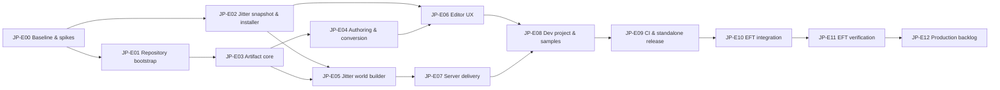

# Jitter Physics Baker Package — декомпозиция работ

Статус: рабочий backlog для реализации.

Источник требований: [JITTER_PHYSICS_PACKAGE_SPEC.md](JITTER_PHYSICS_PACKAGE_SPEC.md).

Документ переводит единое ТЗ в иерархию:

```text
Epic
└── Task
    └── Subtask
```

Идентификаторы предварительные и могут быть заменены Jira/Linear ID при импорте.

## 0. Текущий статус реализации

Обновлено: 2026-08-13. Отметки проставляются только по фактически проверенному результату.

Легенда статуса Task:

- **Готово** — все subtasks и acceptance criteria выполнены и подтверждены прогоном.
- **Частично** — есть работающий результат, но часть acceptance criteria не закрыта; что именно осталось, указано в блоке `Статус`.
- **Не начато** — работа не велась.

### Сводка по эпикам

| Epic | Статус | Комментарий |
|---|---|---|
| JP-E00 | Не начато | Baseline report и characterization fixtures не создавались |
| JP-E01 | Частично | Package/assembly graph/dev project готовы; CI отсутствует |
| JP-E02 | Частично | Snapshot/lock/discovery готовы; installer и receipt lifecycle отсутствуют |
| JP-E03 | Готово | Contracts, codec, manifest, runtime ID, token, golden/corrupt suite |
| JP-E04 | Частично | Authoring/collection/converters/bake pipeline и запись артефакта готовы; EditMode-прогон не выполнялся |
| JP-E05 | Частично | World builder готов и проверен на `.NET`; Unity-сторона не прогонялась |
| JP-E06 | Частично | Setup/About окна есть; Bake UI и artifact management отсутствуют |
| JP-E07 | Частично | `Server~/Tests` и file artifact provider работают; projection/embedded provider/startup API отсутствуют |
| JP-E08–JP-E12 | Не начато | — |

### Что проверено прогоном

```sh
cd Packages/com.datasakura.jitter-physics-baker
./tools~/verify-jitter2-lock.py     # lock совпадает со snapshot (96 файлов)
./tools~/test-jitter2-lock.py       # инварианты канонического хэша (19 проверок)
./tools~/test-dotnet.sh             # 55 тестов, .NET 10, зелёные

cd -
python3 tools/verify-package-meta.py  # полные .meta, нет LFS-указателей
```

Unity EditMode/PlayMode тесты **скомпилированы, но не выполнены**: проект занят открытым редактором, batch-прогон не запускался.

### Известные отклонения от ТЗ

1. **`Jitter2~/Runtime` содержит upstream `2.8.9`, а не EFT-форк.** Это непатченная версия: нет `JITTER_UNITY`, используются аппаратные интринсики. Как `.NET`-снапшот работает и покрыт тестами; как Unity fallback **не проверен**. `compileProfile` в lock описывает фактическое состояние, а не целевое. Детали — `Jitter2~/PATCHES.md`.
2. **JP-T00.2 characterization fixtures отсутствуют**, поэтому acceptance criteria JP-T04.3 «converters проходят характеризационные fixtures текущего `JitterBody`» формально не закрыт: семантика конвертеров зафиксирована собственными тестами, а не сравнением с EFT.


## 1. Правила backlog-а

- `P0` — блокирует standalone package или EFT POC.
- `P1` — необходимо для релиза `v0.1.0`, но не блокирует ранний technical slice.
- `P2` — post-v1 discovery/production backlog.
- Каждая Task должна завершаться кодом/артефактом и проверяемыми acceptance criteria.
- Tests, документация и безопасный update path входят в Task, а не оставляются «на потом».
- Изменения существующего EFT Jitter2, `Jitter2.Unity.csproj`, `EFT.Runtime.csproj`, Dockerfile и `Jitter.Netick.Adapter` не входят в scope.
- Календарные оценки не фиксируются до завершения Epic JP-E00 и определения состава команды.

## 2. Release gates

### Gate A — Architecture/Foundation Ready

Завершены JP-E00–JP-E03:

- подтверждён baseline;
- package импортируется без Jitter;
- dormant Jitter/installer/lock работают;
- artifact contracts/codec зафиксированы golden tests.

### Gate B — Standalone Package `v0.1.0-rc`

Завершены JP-E04–JP-E09:

- authoring/bake/runtime world builder готовы;
- Unity и `.NET` строят одинаковую static topology;
- server source delivery работает;
- clean project/dev project/samples/CI проходят;
- package не зависит от EFT/Netick.

### Gate C — EFT POC Accepted

Завершены JP-E10–JP-E11:

- package подключён в EFT без миграции Jitter2/server build;
- client/server загружают exact artifact;
- Netick handshake проверяет artifact hash и runtime ID;
- runtime Jitter prediction/authority сохраняются;
- Shooter E2E и Docker smoke проходят.

## 3. Dependency map



Критический путь:

```text
JP-E00 -> JP-E01/JP-E02 -> JP-E03 -> JP-E05 -> JP-E07
       -> JP-E08 -> JP-E09 -> JP-E10 -> JP-E11
```

## JP-E00. Baseline, characterization и architecture spikes

Приоритет: P0.

Результат эпика: подтверждены факты проекта и рискованные части архитектуры до основной реализации.

### JP-T00.1. Зафиксировать baseline EFT и Custom Navigation

Зависимости: нет.

Subtasks:

- [ ] Проверить Unity version, `.NET 10`, tick rate и текущие Jitter compile profiles.
- [ ] Зафиксировать client flow: world creation, prediction, rollback, `World.Step`.
- [ ] Зафиксировать server flow: world creation, static setup, connection approval, `World.Step`.
- [ ] Найти все call sites `ShooterMotor.BuildStaticWorld`.
- [ ] Изучить Custom Navigation package layout, artifact flow, `Server~` и installers.
- [ ] Запустить и записать baseline Unity/server/Docker commands и результаты.

Acceptance criteria:

- [ ] Есть baseline report с командами, версиями и текущей runtime sequence.
- [ ] Зафиксированы исходные build/test failures, если они существуют.
- [ ] Ни один production/source файл не изменён ради baseline.

### JP-T00.2. Characterization текущего `JitterBody` collider mapping

Зависимости: JP-T00.1.

Subtasks:

- [ ] Зафиксировать Box center/size/rotation/scale semantics.
- [ ] Зафиксировать Sphere uniform/non-uniform scale semantics.
- [ ] Зафиксировать Capsule direction X/Y/Z и cylinder length semantics.
- [ ] Зафиксировать Mesh transform/winding/index policy.
- [ ] Добавить characterization fixtures/tests либо точный executable report.

Acceptance criteria:

- [ ] Новые package converters можно сравнить с текущим поведением по числовым fixtures.
- [ ] Все намеренные отличия требуют отдельного решения, а не появляются неявно.

### JP-T00.3. Spike clean-import/bootstrap

Зависимости: JP-T00.1.

Subtasks:

- [ ] Создать минимальный Jitter-free bootstrap asmdef.
- [ ] Подтвердить, что dormant `JitterIntegration~/` не импортируется Unity.
- [ ] Проверить clean project без `Jitter2.Core`.
- [ ] Проверить активацию integration после появления `Jitter2.Core`.

Acceptance criteria:

- [ ] Package можно импортировать без missing assembly errors до installer-а.
- [ ] Принята финальная assembly activation strategy.

### JP-T00.4. Spike server source и embedded artifact delivery

Зависимости: JP-T00.1.

Subtasks:

- [ ] Проверить SDK default compile glob внутри `EFT.Server/EFT.Runtime/`.
- [ ] Собрать минимальную generated source projection без ProjectReference.
- [ ] Создать прототип embedded exact-bytes `.g.cs` provider.
- [ ] Проверить chunking, восстановление bytes и SHA-256.
- [ ] Определить POC size cap и failure UX.
- [ ] Подтвердить сборку текущим Dockerfile.

Acceptance criteria:

- [ ] Прототип не требует изменений `EFT.Runtime.csproj`, `Jitter2.Unity.csproj` или Dockerfile.
- [ ] Восстановленные bytes byte-for-byte совпадают с input artifact.
- [ ] Oversized payload отклоняется до генерации/компиляции.

Epic acceptance:

- [ ] Все четыре spikes закрыты и отражены в implementation plan.
- [ ] Не осталось неизвестного P0-риска в bootstrap/server delivery.

## JP-E01. Standalone repository и package bootstrap

Приоритет: P0.

Результат эпика: отдельный Git UPM package и Unity dev project существуют и компилируются без Jitter.

### JP-T01.1. Создать package repository

Зависимости: JP-E00.

Статус: **Готово**.

Subtasks:

- [x] Создать `package.json` для `com.datasakura.jitter-physics-baker`.
- [x] Добавить README, CHANGELOG, LICENSE, Third Party Notices.
- [x] Добавить `.gitignore` и `.gitattributes` с line-ending policy.
- [x] Создать `Runtime`, `Authoring`, `Editor`, `Tests`, `Samples~`, `Server~`, `Documentation~`, `tools~`.
- [x] Зафиксировать minimal Unity version и SemVer policy.

Acceptance criteria:

- [x] UPM распознаёт package по local path.
- [x] Repository не содержит `Library`, `Temp`, `obj`, `bin`, secrets или случайные binaries.

Примечание: `.gitattributes` явно запрещает LFS внутри package-а — UPM клонирует git URL без LFS, и любой LFS-указатель приехал бы к потребителю как ~130-байтовый текстовый файл.

### JP-T01.2. Создать Jitter-free assembly graph

Зависимости: JP-T01.1, JP-T00.3.

Статус: **Готово**.

Subtasks:

- [x] Создать `DataSakura.JitterPhysics.Contracts`.
- [x] Создать `DataSakura.JitterPhysics.ArtifactCodec`.
- [x] Создать `DataSakura.JitterPhysics.UnityArtifact`.
- [x] Создать `DataSakura.JitterPhysics.Authoring`.
- [x] Создать `DataSakura.JitterPhysics.Editor`.
- [x] Настроить `noEngineReferences` и Editor-only boundaries.
- [x] Проверить отсутствие references на EFT, Netick и Jitter.

Acceptance criteria:

- [x] Assembly graph компилируется без установленного Jitter.
- [x] Runtime Contracts/Codec не зависят от UnityEngine.
- [x] Editor assembly не попадает в player build.

Проверяется тестом `JitterPhysicsPackageLayoutTests`: он читает все `.asmdef` package-а и падает, если хоть один ссылается на `Jitter2.Core`, `Netick` или `EFT.*`. Ревью такие вещи пропускает, тест — нет.

### JP-T01.3. Создать отдельный Unity dev/QA project

Зависимости: JP-T01.1.

Статус: **Готово**.

Subtasks:

- [x] Создать Unity project поддерживаемой версии.
- [x] Подключить package через local `file:` dependency.
- [x] Настроить Test Framework.
- [x] Добавить clean-import fixture без Jitter.
- [x] Описать local developer bootstrap.

Acceptance criteria:

- [x] Clean checkout dev project открывается и компилируется.
- [x] Package source редактируется без копирования в `Assets`.

### JP-T01.4. Добавить CI skeleton

Зависимости: JP-T01.1, JP-T01.3.

Статус: **Не начато**.

Subtasks:

- [ ] Repository/package validation job.
- [ ] Unity clean-import job.
- [ ] Placeholder EditMode/PlayMode jobs.
- [ ] Placeholder `.NET 10` job.
- [ ] Artifact/reports retention policy.

Acceptance criteria:

- [ ] CI запускается на PR и показывает отдельные package/Unity/.NET stages.

Заготовка есть: `tools~/verify-jitter2-lock.py`, `tools~/test-jitter2-lock.py` и `tools~/test-dotnet.sh` уже пригодны как CI-шаги, не хватает самого workflow.

Epic acceptance:

- [x] Package импортируется в clean project без Jitter и compile errors.
- [x] Базовый repository/assembly layout соответствует исходному ТЗ.

## JP-E02. Dormant Jitter2, lock и installer

Приоритет: P0.

Результат эпика: package безопасно использует внешний Jitter либо устанавливает fallback, контролируя exact compatibility.

### JP-T02.1. Создать `Jitter2~/` snapshot

Зависимости: JP-E00, JP-E01.

Статус: **Частично** — snapshot синхронизирован из upstream `2.8.9`, а не из EFT.

Subtasks:

- [x] Синхронизировать текущие EFT Jitter `.cs` sources в `Jitter2~/Runtime`.
  - Выполнено из upstream `2.8.9` (96 файлов). EFT-форк не был доступен; переключение — одной командой `sync-jitter2.py --source`.
- [x] Добавить upstream commit, `PATCHES.md`, license и provenance.
- [x] Создать standalone Unity asmdef template без EFT/Netick references.
- [x] Зафиксировать Unity/.NET compile profiles.
- [x] Проверить, что Unity не импортирует snapshot.

Acceptance criteria:

- [ ] Snapshot соответствует принятой EFT revision.
  - Сейчас это upstream `2.8.9` (`c15bc6ab`). Закроется после синка форка.
- [x] Fallback asmdef создаёт assembly `Jitter2.Core`.
- [x] В package import не появляется вторая Jitter assembly.

Snapshot компилируется и симулирует: `Server~/Tests` строит из него мир, статическое тело держит позу, динамическое ложится на него, сборка подтверждённо single precision.

### JP-T02.2. Реализовать canonical source hash и lock

Зависимости: JP-T02.1.

Статус: **Готово**.

Subtasks:

- [x] Реализовать include/exclude traversal.
- [x] Нормализовать paths, ordering, encoding и line endings.
- [x] Включить `.cs`, `csc.rsp` и canonical compile profile.
- [x] Исключить consumer asmdef/meta/build output.
- [x] Сгенерировать `jitter2.lock.json`.
- [x] Реализовать `verify-jitter2-lock`.
- [x] Добавить known-hash tests.

Acceptance criteria:

- [x] Hash одинаков на поддерживаемых ОС.
  - Текстовые файлы приводятся к LF до хэширования, поэтому CRLF-checkout на Windows даёт тот же результат.
- [x] Изменение любого compile-relevant input меняет hash.
- [x] Consumer-specific asmdef path/reference не меняет source identity.

Хэш считают **две независимые реализации** — `tools~/hash-jitter2.py` для CI и `JitterPhysicsSourceHasher` для редактора. Правила отбора файлов, порядка, переносов строк и сериализации compile profile заданы пакетом, а не платформой: `pathlib.match` менял семантику `**` между версиями Python, и на нём паритет был бы недостижим.

### JP-T02.3. Реализовать Jitter discovery/compatibility report

Зависимости: JP-T02.2, JP-E01.

Статус: **Готово**.

Subtasks:

- [x] Искать `Jitter2.Core` через compilation metadata и AssetDatabase.
- [x] Различать source asmdef и precompiled plugin.
- [x] Показывать все найденные paths.
- [x] Считать actual source hash/compile profile.
- [x] Классифицировать `Missing`, `Compatible`, `Incompatible`, `Duplicate`, `UnsupportedPlugin`.
- [x] Добавить machine-readable result для CI.

Acceptance criteria:

- [x] Detection не зависит от folder path.
- [x] Duplicate/incompatible result содержит actionable diagnostics.

Реализация: `Editor/Bootstrap/JitterPhysicsCompatibilityReport.cs`, UI — `Tools > DataSakura > Jitter Physics > Setup`. Окно только читает; установка остаётся отдельной явной командой.

### JP-T02.4. Реализовать `Install Jitter2 into Project`

Зависимости: JP-T02.1, JP-T02.3.

Статус: **Не начато**.

Subtasks:

- [ ] Сделать staging copy dormant snapshot-а.
- [ ] Применить standalone asmdef template.
- [ ] Проверить hash staging и final copy.
- [ ] Заблокировать операцию при существующем `Jitter2.Core`.
- [ ] Выполнить `AssetDatabase.Refresh` и post-install validation.

Acceptance criteria:

- [ ] Новый проект получает ровно одну совместимую `Jitter2.Core`.
- [ ] Existing external Jitter никогда не перезаписывается.

Блокер: текущий snapshot — непатченный upstream, его Unity-совместимость не подтверждена (см. отклонение 1 в разделе 0). Устанавливать его как fallback пока нельзя.

### JP-T02.5. Реализовать Jitter integration installer

Зависимости: JP-T02.3, JP-T02.4, JP-E01.

Статус: **Частично** — подготовлены исходники и шаблон, самого установщика нет.

Subtasks:

- [x] Подготовить `JitterIntegration~/UnityAssemblyTemplate`.
- [x] Создать asmdef references по names, включая `Jitter2.Core`.
- [ ] Устанавливать integration отдельно от Jitter.
- [ ] Проверять version/hash installed projection.
- [x] Не создавать dependency cycle с `EFT.Runtime`.
  - Package не содержит networking-типов, поэтому обратная зависимость ничем не навязывается; правило описано в `JitterIntegration~/README.md`.

Acceptance criteria:

- [ ] С compatible external Jitter устанавливается только adapter.
- [ ] С fallback Jitter adapter компилируется после установки.
- [x] Clean import до установки остаётся рабочим.

### JP-T02.6. Реализовать receipt/update/uninstall lifecycle

Зависимости: JP-T02.4, JP-T02.5.

Статус: **Не начато**.

Subtasks:

- [ ] Записывать ownership, package version, paths и file hashes.
- [ ] Сделать idempotent повторную установку.
- [ ] Обновлять только неизменённые owned files.
- [ ] Сохранять изменённые пользователем файлы.
- [ ] Удалять только owned + unchanged files.
- [ ] Добавить interrupted-install recovery.

Acceptance criteria:

- [ ] Update/uninstall не удаляют внешний или изменённый код.
- [x] Import/`InitializeOnLoad` не выполняют mutation.
  - Package не содержит `InitializeOnLoad`-мутаций: discovery только читает.

### JP-T02.7. Автоматизировать sync EFT -> snapshot

Зависимости: JP-T02.1, JP-T02.2.

Статус: **Частично** — инструмент готов, CI-контроля drift нет.

Subtasks:

- [x] Реализовать `sync-jitter2 --source`.
  - Поддержаны оба режима: `--source <path>` для форка и `--repo/--ref` для upstream.
- [x] Генерировать diff/provenance report.
  - Выводятся число файлов, commit, предыдущий и новый хэш и факт изменения; provenance пишется в lock и `PATCHES.md`.
- [x] Требовать lock regeneration.
  - Lock обновляется той же командой, рассинхрон невозможен по построению.
- [ ] Запрещать manual drift snapshot-а в CI.

Acceptance criteria:

- [x] Один command воспроизводимо синхронизирует accepted EFT revision.
- [ ] CI ловит правку snapshot-а без source/provenance/lock update.
  - `verify-jitter2-lock.py` уже это детектирует, но не подключён к CI (см. JP-T01.4).

Epic acceptance:

- [ ] External, fallback, duplicate и incompatible scenarios покрыты tests.
  - Классификация реализована и покрыта, сценарии установки — нет.
- [x] Jitter в EFT не изменён.
- [ ] Gate A Jitter requirements выполнены.

## JP-E03. Artifact Contracts, codec и compatibility token

Приоритет: P0.

Результат эпика: зафиксирован безопасный deterministic artifact v1 без зависимости на Unity/Jitter.

### JP-T03.1. Спроектировать DTO и schema v1

Зависимости: JP-E01, JP-T00.2.

Статус: **Готово**.

Subtasks:

- [x] World settings DTO.
- [x] Body record DTO.
- [x] Box/Sphere/Capsule/TriangleMesh shape DTO.
- [x] Stable source/shape IDs.
- [x] Manifest DTO.
- [x] Safety limits/config.
- [x] Документировать numeric tags/header layout.

Acceptance criteria:

- [x] DTO не содержит Unity/Jitter types.
- [x] Artifact не содержит runtime Jitter internals.

Layout схемы 1 задокументирован в `PhysicsArtifactFormat.cs` и зафиксирован golden-тестом.

### JP-T03.2. Реализовать canonical writer

Зависимости: JP-T03.1.

Статус: **Готово**.

Subtasks:

- [x] Little-endian primitive writer.
- [x] Bounded UTF-8 encoding.
- [x] Float finite/`-0` normalization.
- [x] Quaternion normalization/sign convention.
- [x] Canonical records ordering contract.
- [x] SHA-256 canonical binary.

Acceptance criteria:

- [x] Repeat write одного DTO даёт exact bytes/hash.
- [x] Writer отклоняет invalid values до создания final artifact.

Writer намеренно строгий: он отказывается писать записи не в порядке, а не сортирует их молча. Пересортировка скрыла бы недетерминированный baker — то есть ровно ту ошибку, ради которой формат и существует.

### JP-T03.3. Реализовать bounded reader/validator

Зависимости: JP-T03.1.

Статус: **Готово**.

Subtasks:

- [x] Проверять hash до parse.
- [x] Проверять magic/schema/precision/endianness/runtime ID.
- [x] Проверять counts/lengths до allocation.
- [x] Проверять IDs, floats, quaternions, mesh indices.
- [x] Отклонять trailing garbage.
- [x] Возвращать typed errors.

Acceptance criteria:

- [x] Corrupt/truncated/oversized inputs не вызывают unbounded allocations.
- [x] Reader не изменяет Jitter world и не зависит от Jitter.

Порядок проверок задан намеренно: хэш проверяется **до** разбора, поэтому счётчикам подменённого файла не доверяют ни разу.

### JP-T03.4. Реализовать manifest и artifact identity

Зависимости: JP-T03.2, JP-T03.3.

Статус: **Готово**.

Subtasks:

- [x] Создать deterministic manifest fields.
- [x] Реализовать binary/manifest cross-check.
- [x] Создать content-addressed filenames.
- [x] Исключить timestamps/machine paths из identity.
- [x] Создать Unity artifact metadata contract.

Acceptance criteria:

- [x] Manifest не может подменить binary identity.
- [x] Client/server artifactHash — SHA-256 одних bytes.

### JP-T03.5. Реализовать `runtimeCompatibilityId`

Зависимости: JP-T02.2, JP-T03.1.

Статус: **Готово**.

Subtasks:

- [x] Canonicalize formula inputs.
- [x] Включить schema, Jitter source hash, compile/precision profile.
- [x] Включить collider/shape/world-builder semantics versions.
- [x] Исключить manual override.
- [x] Добавить known-vector tests.

Acceptance criteria:

- [x] Любое runtime-semantic изменение меняет ID.
- [x] ID одинаков в Editor, Unity runtime и `.NET` tests.

ID всегда вычисляется и никогда не пишется руками: вручную поддерживаемое значение — это число, которое кто-то забудет обновить, а скрытая за этим ошибка — клиент и сервер, молча симулирующие разные миры.

### JP-T03.6. Реализовать transport-agnostic compatibility token

Зависимости: JP-T03.4, JP-T03.5.

Статус: **Готово**.

Subtasks:

- [x] Кодировать magic/version/levelId.
- [x] Добавить artifact SHA-256.
- [x] Добавить runtimeCompatibilityId.
- [x] Ограничить payload/string lengths.
- [x] Реализовать strict parser и typed errors.

Acceptance criteria:

- [x] Token codec не зависит от Netick.
- [x] Missing/truncated/oversized/unknown-version payload отклоняется.

Токен несёт **и** artifact hash, **и** runtime ID: проверка только хэша пропустила бы клиента с правильной картой, но другой семантикой — случай, который тяжелее всего диагностировать потом.

### JP-T03.7. Зафиксировать golden/corrupt test suite

Зависимости: JP-T03.2–JP-T03.6.

Статус: **Готово**.

Subtasks:

- [x] Golden minimal box bytes.
- [x] Roundtrip all shapes/settings.
- [x] `-0/+0`, `q/-q` fixtures.
- [x] One-field-change hash fixtures.
- [x] Corrupt matrix.
- [x] Manifest mismatch fixtures.

Acceptance criteria:

- [x] Golden bytes нельзя изменить без schema bump.
- [x] Gate A artifact requirements выполнены.

Ожидаемые байты в golden-тесте собираются **по полям вручную**, а не сравнением writer-а с самим собой: это независимая формулировка формата, поэтому правка writer-а роняет сборку, а не переопределяет молча, что такое артефакт.

## JP-E04. Unity authoring, collider conversion и deterministic bake

Приоритет: P0.

Результат эпика: designer может явно описать static world и получить deterministic artifact.

### JP-T04.1. Реализовать authoring components

Зависимости: JP-E01, JP-T03.1.

Статус: **Частично** — компоненты готовы, правило «ровно один активный level» не реализовано.

Subtasks:

- [x] `JitterPhysicsLevel`.
- [x] `JitterStaticBodySource`.
- [x] `JitterPhysicsWorldProfile`.
- [x] Stable serialized `sourceId` generation/repair policy.
- [x] Inspector validation hooks.
  - `OnValidate` в профиле мира зажимает значения в допустимый диапазон; кастомных инспекторов пока нет.

Acceptance criteria:

- [x] В bake попадают только explicit sources.
- [ ] 0 или >1 active level даёт actionable error.
  - Отсутствие sources и отсутствие профиля диагностируются; поиска дублирующихся `JitterPhysicsLevel` в сцене ещё нет.

Идентификаторы санитизируются один раз и затем сохраняются: переименование объекта не меняет артефакт, потому что id — это идентичность, а имя — только подпись.

### JP-T04.2. Реализовать deterministic source collection

Зависимости: JP-T04.1.

Статус: **Готово**.

Subtasks:

- [x] Traversal `geometryRoot`/sources.
- [x] Canonical source order по `sourceId`.
- [x] Canonical collider key: path/sibling/component/type.
- [x] Duplicate ID/key diagnostics.
- [x] Inactive/disabled policy.

Acceptance criteria:

- [x] Collection order не зависит от Unity instance ID или hash enumeration.

Ключ шейпа выводится из структуры (путь, sibling index, индекс компонента, тип). Instance id и порядок обхода стабильны внутри сессии и произвольны между сессиями — byte-exact bake этого не переживает. Покрыто тестом: перестановка siblings не меняет байты.

### JP-T04.3. Реализовать primitive converters

Зависимости: JP-T00.2, JP-T04.2, JP-T03.1.

Статус: **Частично** — конвертеры готовы, сверка с EFT-характеризацией невозможна без JP-T00.2.

Subtasks:

- [x] Box converter.
- [x] Sphere converter + non-uniform warning.
- [x] Capsule X/Y/Z converter.
- [x] Center/local pose/scale conversion.
- [x] Shear/zero/NaN/negative-scale validation.

Acceptance criteria:

- [ ] Converters проходят characterization fixtures текущего `JitterBody`.
  - Fixtures не существуют (JP-T00.2 не выполнялась). Семантика зафиксирована собственными тестами; сверку с EFT нужно провести отдельно.

Единственное приближение — сфера при неравномерном масштабе — сделано консервативно (по наибольшей оси) и сопровождается warning: игрок, задевающий чуть большую геометрию, дешевле игрока, проходящего сквозь стену.

### JP-T04.4. Реализовать MeshCollider converter

Зависимости: JP-T04.2, JP-T03.1.

Статус: **Частично** — конвертер готов, raycast-проверка ориентации не выполнялась.

Subtasks:

- [x] Получить readable mesh data в Editor.
- [x] Применить full transform matrix.
- [x] Исправить winding при negative determinant.
- [x] Проверить indices/triangle count.
- [x] Отклонить degenerate/unreadable/invalid mesh.

Acceptance criteria:

- [x] Mesh fixture даёт deterministic vertices/indices.
- [ ] Raycast orientation ожидаема после world build.
  - Проверено, что меш превращается в ожидаемое число треугольников; отдельного raycast-фикстура нет.

Вершины запекаются в body-local полной матрицей, поэтому неравномерный или скошенный трансформ представлен точно. При отрицательном детерминанте разворачивается winding: иначе поверхность смотрела бы внутрь и уровень стал бы сплошным изнутри.

### JP-T04.5. Реализовать validator

Зависимости: JP-T04.1–JP-T04.4, JP-T02.3.

Статус: **Готово** — диагностика собрана, `JitterPhysicsBakeCommand` подставляет `runtimeCompatibilityId` из compatibility report.

Subtasks:

- [x] Setup/Jitter compatibility validation.
  - `JitterPhysicsBakeCommand` берёт id только из `JitterPhysicsCompatibilityReport`; передать его аргументом нельзя.
- [x] Authoring/ID validation.
- [x] Collider/transform/mesh validation.
- [x] World profile/tick/precision validation.
- [x] Issue severity, object path, ping/select metadata.
- [x] Блокировать bake на error.

Acceptance criteria:

- [x] Unsupported input не пропускается silently.
- [x] Incompatible Jitter hash блокирует bake.
  - `Missing`/`Incompatible`/`Duplicate`/`UnsupportedPlugin` дают отказ с объяснением причины.

### JP-T04.6. Реализовать deterministic bake pipeline

Зависимости: JP-E03, JP-T04.5.

Статус: **Готово** — артефакт строится, хэшируется и атомарно записывается в проект.

Subtasks:

- [x] Collect -> convert -> canonicalize -> write -> hash.
- [x] Создать manifest.
- [x] Создать `JitterPhysicsArtifactAsset` + `TextAsset`.
- [x] Использовать temp + atomic replace.
- [x] Не выполнять bake в Play Mode.
- [x] Сохранять previous valid artifact при failure.

Acceptance criteria:

- [x] Repeat bake exact.
- [x] One semantic source change меняет hash.
- [x] Runtime повторно проверяет asset binary hash.
  - `JitterPhysicsArtifactLoader` перехэширует payload и сверяет метаданные asset-а с декодированным содержимым.

Сборка всё-или-ничего: частично конвертируемый уровень не записывается как частично корректный артефакт, потому что недостающая геометрия проявилась бы дырой в стене в рантайме, а не сообщением при запекании.

Epic acceptance:

- [x] Box/Sphere/Capsule/Mesh baking проходит EditMode fixtures.
  - Fixtures написаны и компилируются; прогон в Unity Test Runner не выполнялся.
- [ ] Designer получает actionable validation и stable artifact.
  - Валидация actionable, артефакт пишется в проект; прогон в Unity Test Runner не выполнялся.

## JP-E05. Jitter world builder и runtime integration source

Приоритет: P0.

Результат эпика: один source set строит static Jitter topology в Unity и `.NET`.

### JP-T05.1. Подготовить Jitter integration source boundary

Зависимости: JP-E02, JP-E03.

Статус: **Частично** — `.NET`-сторона проверена прогоном, Unity-сторона нет.

Subtasks:

- [x] Создать `JitterIntegration~/Runtime`.
- [x] Исключить UnityEngine/Editor/Netick dependencies.
- [x] Настроить Unity assembly template reference по имени `Jitter2.Core`.
- [x] Настроить `.NET` source inclusion against consumer Jitter assembly.

Acceptance criteria:

- [ ] Один adapter source set компилируется в Unity и `.NET` fixtures.
  - Под `.NET` компилируется и проходит тесты. В Unity не проверено: установщик ещё не реализован (JP-T02.5).

### JP-T05.2. Реализовать descriptor -> Jitter shapes

Зависимости: JP-T05.1, JP-E03.

Статус: **Готово**.

Subtasks:

- [x] Box/Sphere/Capsule construction.
- [x] TriangleMesh/TriangleShape construction.
- [x] Local pose/material application.
- [x] Создание strictly в artifact order.

Acceptance criteria:

- [x] Runtime types/counts соответствуют artifact records.

Локальная поза оборачивается в `TransformedShape` только когда она не единичная: обёртка на каждый шейп добавила бы лишнюю косвенность в каждый collision query без пользы.

### JP-T05.3. Реализовать static world builder

Зависимости: JP-T05.2.

Статус: **Готово**.

Subtasks:

- [x] Применить/проверить world settings.
- [x] Создать static bodies before dynamic bodies.
- [x] Реализовать Ready state.
- [x] Реализовать duplicate Apply guard.
- [x] Реализовать failure rollback/dispose policy.

Acceptance criteria:

- [x] Partial world никогда не становится Ready.
- [x] Повторный Apply не создаёт duplicate statics.

Повторное применение отклоняется, а не сливается: слияние молча удвоило бы каждую стену уровня. При исключении все созданные тела удаляются — частично построенный уровень хуже отсутствующего, потому что выглядит рабочим.

### JP-T05.4. Реализовать metrics и topology fingerprint

Зависимости: JP-T05.3.

Статус: **Частично** — fingerprint реализован и воспроизводим, паритет Unity/`.NET` не измерялся.

Subtasks:

- [x] Body/shape/triangle counts.
- [x] Elapsed time.
- [x] Artifact/runtime IDs.
- [x] Canonical topology fingerprint.
- [x] Safe diagnostic formatting.

Acceptance criteria:

- [ ] Unity и `.NET` дают exact одинаковый fingerprint.
  - В пределах `.NET` подтверждено, в том числе что декодированный артефакт даёт тот же fingerprint, что исходный. Сравнение с Unity требует установленного integration.

### JP-T05.5. Добавить world-builder tests

Зависимости: JP-T05.2–JP-T05.4.

Статус: **Частично** — `.NET`-набор готов, Unity-набора нет.

Subtasks:

- [x] Load all supported shapes.
- [ ] Raycast fixtures.
- [x] Falling body/resting ground.
- [x] Dynamic body vs cover.
- [x] Duplicate Apply.
- [x] Failure/rollback.
- [x] Settings/tick validation.

Acceptance criteria:

- [ ] Tests проходят против dormant Jitter в `.NET` и установленного Jitter в Unity.
  - `.NET`: 45 тестов зелёные. Unity: не проверялось.

Ключевой тест — не «объекты созданы», а «на уровне можно стоять»: динамическое тело падает и приходит в покой на запечённой земле.

Epic acceptance:

- [x] Shared loader/world builder готов для client/server integration.
- [x] Package не владеет и не вызывает tick loop.

## JP-E06. Editor UX, export и diagnostics

Приоритет: P1.

Результат эпика: setup/bake/export доступны через безопасный и диагностируемый Editor workflow.

### JP-T06.1. Реализовать Setup UI

Зависимости: JP-E02.

Статус: **Частично** — отчёт и экспорт готовы, действий установки нет.

Subtasks:

- [x] Показать Jitter path/type/ownership/hash/status.
- [ ] Добавить installer/update/uninstall actions.
  - Зависит от JP-T02.4–JP-T02.6.
- [x] Показать package/schema/runtime IDs.
- [x] Добавить compatibility report export.
  - Копирование JSON в буфер и запись в файл.

Acceptance criteria:

- [x] User понимает, какая Jitter copy активна и почему операция заблокирована.
- [ ] Полный setup workflow выполняется из окна.

Окно только читает. Окно, которое меняет проект, пока на него смотрят, — это способ случайно перезаписать собственную копию Jitter потребителя.

Дополнительно реализовано вне исходного объёма Task: `Tools > DataSakura > Jitter Physics > About` — версии package/schema и состояние всех сборок, включая наличие и дублирование `Jitter2.Core`.

### JP-T06.2. Реализовать Level & Sources / Bake UI

Зависимости: JP-E04.

Subtasks:

- [ ] Level/profile/source selection/status.
- [ ] Validation issue list + ping/select.
- [ ] `Validate`, `Validate + Bake`, `Bake for Client`.
- [ ] Counts/size/time/hash output.

Acceptance criteria:

- [ ] Полный bake workflow выполняется без ручного вызова scripts.

### JP-T06.3. Реализовать artifact management/export

Зависимости: JP-T04.6.

Subtasks:

- [ ] Inspect generated artifacts.
- [ ] Export exact binary + manifest без rebake.
- [ ] Delete только explicit выбранного artifact-а.
- [ ] Copy hashes/report.
- [ ] Safe temp/replace and previous-valid preservation.

Acceptance criteria:

- [ ] Exported server bytes exact совпадают с client artifact.

### JP-T06.4. Реализовать diagnostics

Зависимости: JP-E03, JP-E05.

Subtasks:

- [ ] Codec roundtrip.
- [ ] Repeat determinism check.
- [ ] Runtime compatibility check.
- [ ] Topology fingerprint display.
- [ ] Short/full hash logging policy.

Acceptance criteria:

- [ ] Основные mismatch причины диагностируются без запуска match.

Epic acceptance:

- [ ] Editor mutations происходят только по explicit actions.
- [ ] Failed action не повреждает existing artifacts/installations.

## JP-E07. Server source delivery и `.NET` runtime

Приоритет: P0.

Результат эпика: generic server может встроить shared loader без PackageCache и precompiled Jitter-dependent DLL.

### JP-T07.1. Создать server runtime source projection

Зависимости: JP-E03, JP-E05, JP-T00.4.

Subtasks:

- [ ] Определить source list Contracts/Codec/Builder/Providers.
- [ ] Реализовать projection manifest.
- [ ] Копировать sources в configurable consumer project folder.
- [ ] Исключить Unity-only source.
- [ ] Проверить отсутствие PackageCache paths.

Acceptance criteria:

- [ ] Consumer `.NET 10` project компилирует projection против своей Jitter assembly.

### JP-T07.2. Реализовать server projection installer lifecycle

Зависимости: JP-T07.1, JP-T02.6.

Subtasks:

- [ ] Явный target folder selection.
- [ ] Staging copy.
- [ ] Receipt/package version/file hashes.
- [ ] Idempotent update.
- [ ] Modified-file protection/uninstall.
- [ ] CI validation command.

Acceptance criteria:

- [ ] Package update не оставляет незаметно устаревший server runtime.

### JP-T07.3. Реализовать file artifact provider

Зависимости: JP-E03.

Статус: **Готово** — `FilePhysicsArtifactProvider` за общей границей `IPhysicsArtifactProvider`.

Subtasks:

- [x] Load immutable binary/manifest path.
  - Провайдер конфигурируется путём к manifest-у (`--physics-manifest <path>`), payload читается из его же папки по имени из манифеста; переименование при доставке покрывается явным payload path.
- [x] Validate before returning artifact.
  - Хэш, декодирование, семантический валидатор и cross-check манифеста выполняются до возврата; при заданном `runtimeCompatibilityId` артефакт чужой семантики отклоняется здесь же.
- [x] Typed missing/corrupt errors.
  - Добавлен код `SourceUnavailable` (файла нет/не читается) — он отделён от кодов повреждения, потому что действие оператора другое: доставить артефакт, а не перепечь его.
- [x] Документировать mount/content/registry integration boundary.
  - `Server~/README.md`: пакет не доставляет артефакт, а определяет, как сервер его принимает.

Acceptance criteria:

- [x] Provider не предполагает EFT path или deploy system.
  - Ни путей, ни имён проектов потребителя; манифест — недоверенный вход, имя payload-а обязано быть простым именем файла, иначе отказ.

### JP-T07.4. Реализовать embedded exact-bytes provider/export

Зависимости: JP-T00.4, JP-T06.3.

Subtasks:

- [ ] Generate `.g.cs` from already baked bytes.
- [ ] Разбить payload на safe chunks.
- [ ] Восстановить bytes один раз при startup.
- [ ] Повторно проверить SHA-256 и manifest.
- [ ] Реализовать configurable hard size cap.
- [ ] Добавить determinism и oversized tests.

Acceptance criteria:

- [ ] Input/output bytes exact.
- [ ] Генератор не делает rebake.
- [ ] Provider подходит для EFT POC без build-file changes.

### JP-T07.5. Реализовать server startup API/self-check

Зависимости: JP-T07.3, JP-T07.4, JP-E05.

Subtasks:

- [ ] Resolve selected provider.
- [ ] Validate artifact/runtime/tick settings.
- [ ] Build static world до accept-enabled.
- [ ] Вернуть Ready/typed failure.
- [ ] Вывести safe self-check metrics.

Acceptance criteria:

- [ ] Server не включает connection approval без Ready world.
- [ ] Package не запускает отдельный physics service.

### JP-T07.6. Создать `Server~/Tests`

Зависимости: JP-T02.1, JP-E03, JP-E05, JP-T07.1.

Статус: **Частично** — проект работает, не хватает provider-тестов и parity-фикстуры.

Subtasks:

- [x] `.NET 10` project.
- [x] Direct compile `Jitter2~/Runtime`.
- [x] Применить lock compile profile.
  - `AllowUnsafeBlocks`, single precision; проверяется тестом `typeof(Real) == typeof(float)`.
- [x] Подключить package sources ссылками.
  - Contracts, ArtifactCodec, JitterIntegration и общие тест-файлы включаются по ссылке, без копий: копия — это форк, которого никто не замечает.
- [x] Codec/world-builder/provider tests.
  - Codec, world-builder и file artifact provider покрыты; embedded provider — JP-T07.4.
- [ ] Golden topology parity fixture.

Acceptance criteria:

- [x] Dormant snapshot компилируется и проходит runtime tests в CI.
  - Локально: 55 тестов, `.NET 10`, зелёные. Подключение к CI — JP-T01.4.

Проект существует именно потому, что «зелено в Unity» ничего не говорит про сервер: тот компилирует те же исходники другим компилятором и рантаймом.

Epic acceptance:

- [ ] Server delivery не требует `Library/PackageCache` или отдельный HTTP service.
- [ ] EFT-compatible no-build-file path доказан fixture-ом.

## JP-E08. Standalone dev project, samples и documentation

Приоритет: P1.

Результат эпика: package проверяется и демонстрируется без EFT/Netick.

### JP-T08.1. Настроить два dev-project режима

Зависимости: JP-E02, JP-E05.

Subtasks:

- [ ] Fixture `Installed Fallback`.
- [ ] Fixture `External Jitter`.
- [ ] Automated setup/reset scripts.
- [ ] Compile/PlayMode smoke обоих режимов.

Acceptance criteria:

- [ ] Оба режима используют один package API и проходят CI.

### JP-T08.2. Создать standalone demo fixtures

Зависимости: JP-E04, JP-E05, JP-E06.

Subtasks:

- [ ] Static primitives scene.
- [ ] Static triangle mesh scene.
- [ ] Runtime load + falling body.
- [ ] Determinism/topology diagnostics.
- [ ] Stress static mesh fixture.
- [ ] Генерировать scenes/assets scripts, если GUID fixtures хрупкие.

Acceptance criteria:

- [ ] Demo показывает bake -> load -> runtime Jitter step без EFT/Netick.

### JP-T08.3. Подготовить Samples~

Зависимости: JP-T08.2.

Subtasks:

- [ ] Static World Baking.
- [ ] Runtime Loading.
- [ ] Cross Runtime Parity.
- [ ] Netick Integration Reference без hard dependency/проприетарного code.
- [ ] Проверить optional import/uninstall.

Acceptance criteria:

- [ ] Samples не выполняют project mutations автоматически.

### JP-T08.4. Написать package documentation

Зависимости: JP-E02–JP-E07.

Subtasks:

- [ ] Authoring guide.
- [ ] Artifact format v1.
- [ ] Installing/upgrading Jitter2.
- [ ] Runtime integration.
- [ ] Server source/provider integration.
- [ ] Compatibility/versioning policy.
- [ ] Cross-runtime determinism disclaimer.

Acceptance criteria:

- [ ] Новый consumer может установить и запустить demo по документации.

Epic acceptance:

- [ ] Standalone vertical slice работает без EFT.
- [ ] Все public APIs/workflows документированы.

## JP-E09. Quality gates, CI/CD и standalone release

Приоритет: P0/P1.

Результат эпика: package проходит Standalone DoD и выпускается как pinned Git tag.

### JP-T09.1. Завершить Unity test pipeline

Зависимости: JP-E01–JP-E08.

Subtasks:

- [ ] EditMode tests.
- [ ] PlayMode/runtime smoke.
- [ ] Clean-import/fallback/external modes.
- [ ] IL2CPP mobile smoke.
- [ ] Test artifact cleanup.

Acceptance criteria:

- [ ] Unity jobs стабильны на clean runner.

### JP-T09.2. Завершить `.NET`/cross-runtime pipeline

Зависимости: JP-E03, JP-E05, JP-E07.

Subtasks:

- [ ] `dotnet build/test Server~/Tests`.
- [ ] Exact artifact decode parity.
- [ ] Exact topology fingerprint parity.
- [ ] Provider exact-bytes parity.
- [ ] Declared-tolerance physics comparison.

Acceptance criteria:

- [ ] Unity и `.NET` используют exact artifact и static topology.

### JP-T09.3. Добавить determinism CI

Зависимости: JP-E04, JP-T09.1.

Subtasks:

- [ ] Repeat bake на clean runner.
- [ ] Bake минимум на двух поддерживаемых ОС.
- [ ] Compare SHA-256/golden bytes.
- [ ] Блокировать golden change без schema decision.

Acceptance criteria:

- [ ] Nondeterministic bake блокирует merge.

### JP-T09.4. Добавить release validation

Зависимости: JP-T09.1–JP-T09.3.

Subtasks:

- [ ] SemVer/package.json/tag consistency.
- [ ] Changelog requirement.
- [ ] Licenses/Third Party Notices.
- [ ] Snapshot/lock/provenance consistency.
- [ ] Smoke install Git tag в clean project.
- [ ] Package content hygiene.

Acceptance criteria:

- [ ] Release tag воспроизводимо устанавливается и проходит smoke.

### JP-T09.5. Выпустить `v0.1.0-rc`

Зависимости: JP-T09.4, completion JP-E01–JP-E08.

Subtasks:

- [ ] Пройти standalone DoD checklist.
- [ ] Зафиксировать known limitations.
- [ ] Создать release notes.
- [ ] Опубликовать pinned tag/commit для EFT integration.

Acceptance criteria:

- [ ] Gate B пройден.
- [ ] EFT integration не используется для сокрытия standalone failures.

## JP-E10. Интеграция package-а в EFT

Приоритет: P0 после Gate B.

Результат эпика: EFT использует package artifact/static loader, сохраняя текущий Jitter runtime и server build wiring.

### JP-T10.1. Подключить pinned UPM package

Зависимости: Gate B.

Subtasks:

- [ ] Добавить Git tag/commit dependency.
- [ ] Запустить compatibility validation.
- [ ] Подтвердить `external-compatible` для текущего EFT Jitter.
- [ ] Зафиксировать actual source hash/runtime ID.

Acceptance criteria:

- [ ] Package import не копирует/не меняет EFT Jitter.

### JP-T10.2. Установить Unity Jitter integration

Зависимости: JP-T10.1.

Subtasks:

- [ ] Install только `JitterIntegration`.
- [ ] Подключить вызов из верхней assembly без cycle.
- [ ] Не менять `EFT.Runtime -> JitterIntegration` dependency.
- [ ] Validate receipt/projection.

Acceptance criteria:

- [ ] Existing `Jitter.Netick.Adapter` остаётся рабочим и на месте.

### JP-T10.3. Установить server runtime projection

Зависимости: JP-T10.1, JP-E07.

Subtasks:

- [ ] Export в `EFT.Server/EFT.Runtime/JitterPhysics/`.
- [ ] Validate SDK default source compilation.
- [ ] Validate receipt against UPM version.
- [ ] Build Release без csproj changes.

Acceptance criteria:

- [ ] `EFT.Runtime.csproj` и `Jitter2.Unity.csproj` не изменены.
- [ ] Server продолжает компилировать current Unity Jitter sources.

### JP-T10.4. Авторить и испечь Shooter static world

Зависимости: JP-T10.1, JP-E04, JP-E06.

Subtasks:

- [ ] Добавить `JitterPhysicsLevel`/profile.
- [ ] Разметить ground + минимум два cover source-а.
- [ ] Bake client artifact.
- [ ] Export embedded server artifact.
- [ ] Зафиксировать hash/runtime ID/counts/size.

Acceptance criteria:

- [ ] Embedded provider восстанавливает exact client bytes/hash.

### JP-T10.5. Интегрировать client initialization

Зависимости: JP-T10.2, JP-T10.4.

Subtasks:

- [ ] Выбрать artifact по level ID до connect.
- [ ] Validate artifact/runtime/tick settings.
- [ ] Подготовить compatibility token.
- [ ] Применить static world после `new World`.
- [ ] Завершить до registry/adopt/dynamic bodies/first step.
- [ ] Fail connect при initialization failure.

Acceptance criteria:

- [ ] `ArtifactValidated < StaticApplied < DynamicBodies < FirstPredictedStep` доказан test/log.
- [ ] Prediction/rollback tick loop не изменён.

### JP-T10.6. Интегрировать server initialization

Зависимости: JP-T10.3, JP-T10.4.

Subtasks:

- [ ] Resolve embedded provider.
- [ ] Validate exact bytes/runtime/tick.
- [ ] Применить static world до gameplay/accept.
- [ ] Вывести self-check.
- [ ] Fail-fast без valid artifact.

Acceptance criteria:

- [ ] `ArtifactValidated < StaticWorldBuilt < SelfCheck < AcceptEnabled` доказан.
- [ ] Authoritative `World.Step` остаётся в текущем server tick loop.

### JP-T10.7. Интегрировать Netick handshake

Зависимости: JP-T03.6, JP-T10.5, JP-T10.6.

Subtasks:

- [ ] Client connection data token.
- [ ] Server strict parser в connection approval.
- [ ] Compare protocol/level/artifact/runtime ID.
- [ ] Safe refusal reason.
- [ ] Initial connect + reconnect tests.

Acceptance criteria:

- [ ] Mismatch отклоняется до player spawn.
- [ ] Package core не получает Netick dependency.

### JP-T10.8. Переключить artifact mode без удаления legacy path

Зависимости: JP-T10.5, JP-T10.6.

Subtasks:

- [ ] Добавить explicit artifact/legacy dev mode.
- [ ] Не вызывать `ShooterMotor.BuildStaticWorld` в artifact mode.
- [ ] Добавить duplicate statics guard/count check.
- [ ] Сохранить legacy fallback только вне acceptance path.

Acceptance criteria:

- [ ] Client/server не создают двойную static geometry.

Epic acceptance:

- [ ] Jitter2 folder, `Jitter2.Unity.csproj`, `EFT.Runtime.csproj`, Dockerfile и `Jitter.Netick.Adapter` не изменены/не перенесены.
- [ ] Runtime Jitter продолжает работать на обеих сторонах.

## JP-E11. EFT end-to-end verification и приёмка

Приоритет: P0.

Результат эпика: Gate C подтверждён воспроизводимыми доказательствами.

### JP-T11.1. Проверить happy-path Shooter gameplay

Зависимости: JP-E10.

Subtasks:

- [ ] Server physics self-check before accept.
- [ ] Client/server одинаковые short/full IDs.
- [ ] Player rests on ground.
- [ ] Movement/cover collision.
- [ ] Grounded/jump.
- [ ] Projectile vs static.
- [ ] Player hit/dynamic regression.

Acceptance criteria:

- [ ] Gameplay работает только на baked static geometry в artifact mode.

### JP-T11.2. Проверить fail-fast и mismatch matrix

Зависимости: JP-E10.

Subtasks:

- [ ] Missing client artifact.
- [ ] Missing server artifact.
- [ ] Corrupt bytes/manifest.
- [ ] Different artifact hash.
- [ ] Different runtimeCompatibilityId.
- [ ] Invalid/oversized handshake.

Acceptance criteria:

- [ ] Ни один invalid scenario не допускает player spawn/physics step с partial world.

### JP-T11.3. Проверить prediction и cross-runtime divergence

Зависимости: JP-T11.1.

Subtasks:

- [ ] 60 секунд movement вдоль static geometry с artificial latency/loss.
- [ ] Проверить отсутствие systematic falling/pushing/teleporting.
- [ ] Offline 300-tick identical input fixture Unity/.NET.
- [ ] Записать max/mean position/rotation/velocity error.
- [ ] Проверить одинаковый obstacle outcome.

Acceptance criteria:

- [ ] Drift bounded в объявленном tolerance.
- [ ] Server authority/reconciliation остаются рабочими.

### JP-T11.4. Выполнить performance smoke

Зависимости: JP-T11.1.

Subtasks:

- [ ] Artifact size/counts.
- [ ] Bake/validation/load time.
- [ ] Managed allocation/peak memory, где возможно.
- [ ] First/steady tick comparison.
- [ ] Проверить отсутствие artifact per-tick allocations.

Acceptance criteria:

- [ ] Shooter binary < 1 MiB.
- [ ] Load/world build < 100 ms на принятой dev machine.
- [ ] Нет заметной fixed-tick regression.

### JP-T11.5. Проверить Release и текущий Docker flow

Зависимости: JP-E10.

Subtasks:

- [ ] `dotnet build EFT.Server/EFT.Server.sln -c Release`.
- [ ] Unity compile/EditMode/PlayMode.
- [ ] Current Docker image build без Dockerfile changes.
- [ ] Container start/self-check.
- [ ] Existing Netick weave/NanoSockets smoke.

Acceptance criteria:

- [ ] Текущий container запускает server с embedded artifact и self-check.

### JP-T11.6. Подготовить verification report и sign-off

Зависимости: JP-T11.1–JP-T11.5.

Subtasks:

- [ ] Commands и raw results.
- [ ] Package/Jitter/artifact/runtime IDs.
- [ ] Counts/size/timings.
- [ ] Topology parity evidence.
- [ ] Mismatch refusal evidence.
- [ ] Prediction/dynamic regression evidence.
- [ ] Known limitations/production spikes.

Acceptance criteria:

- [ ] Gate C checklist подписан ответственными за engine/networking/QA.

## JP-E12. Production discovery и post-v1 backlog

Приоритет: P2; не блокирует `v0.1.0`/EFT POC.

### JP-T12.1. Mesh scalability на representative map

Subtasks:

- [ ] Измерить vertices/triangles/proxies/artifact/load/memory/tick.
- [ ] Сравнить simplified meshes, chunks и tiled sources.
- [ ] Выбрать production representation.

### JP-T12.2. Large-world/origin strategy

Subtasks:

- [ ] Определить coordinate bounds production maps.
- [ ] Проверить float32 precision.
- [ ] Спроектировать origin shift identity для artifact/client/server.

### JP-T12.3. Multi-world server

Subtasks:

- [ ] Artifact registry/cache.
- [ ] Несколько independent `World` в process.
- [ ] Global ID/order determinism tests.
- [ ] Lifecycle/memory isolation.

### JP-T12.4. Production artifact delivery

Subtasks:

- [ ] Выбрать file/content/mount/object registry.
- [ ] Immutable version selection/rollback.
- [ ] Signature/attestation decision.
- [ ] Streaming/chunking decision.

### JP-T12.5. Physics feature extensions

Subtasks:

- [ ] Terrain/height field.
- [ ] Materials catalog.
- [ ] Collision layers/filters.
- [ ] Dynamic prefab shape/body definitions.
- [ ] Constraint recipes.
- [ ] Optional Netick integration package.

Epic acceptance:

- [ ] По каждому spike есть решение, измерения и отдельный production implementation backlog.

## 4. Definition of Ready для Task

Task готова к взятию в работу, если:

- [ ] понятен target repository;
- [ ] выполнены указанные dependencies;
- [ ] известны входные APIs/data;
- [ ] acceptance criteria проверяемы;
- [ ] не требуется незафиксированное изменение существующего EFT Jitter/server build;
- [ ] назначен reviewer для public API/artifact format, если они затрагиваются.

## 5. Definition of Done для Task

Task завершена, если:

- [ ] код/артефакты реализованы;
- [ ] релевантные unit/integration tests добавлены и зелёные;
- [ ] error/failure path покрыт;
- [ ] public API/format/workflow документирован;
- [ ] нет неявных mutations и unrelated changes;
- [ ] exact commands/results приложены к тикету;
- [ ] acceptance criteria отмечены доказательствами, а не только словами.

## 6. Рекомендуемая параллелизация

После JP-E00 и JP-E01 можно вести параллельно:

- Track A: JP-E02 — snapshot/installer/lock;
- Track B: JP-E03 — contracts/codec/token;
- Track C: JP-E04 — authoring/characterization после стабилизации DTO;
- Track D: CI/dev-project skeleton.

После JP-E03 и JP-E05:

- Track A: JP-E06 — Editor UX;
- Track B: JP-E07 — server delivery;
- Track C: JP-E08 — samples/docs/fixtures;
- Track D: JP-E09 — CI hardening.

JP-E10 начинается только после Gate B. JP-E11 начинается после полного integration slice JP-E10, кроме подготовки test harness/fixtures, которую можно начать заранее.

## 7. Итоговая сводка backlog-а

| Epic | Название | Gate | Приоритет |
|---|---|---|---|
| JP-E00 | Baseline и spikes | A | P0 |
| JP-E01 | Repository/package bootstrap | A | P0 |
| JP-E02 | Dormant Jitter, lock, installer | A | P0 |
| JP-E03 | Artifact core и token | A | P0 |
| JP-E04 | Authoring/conversion/bake | B | P0 |
| JP-E05 | Jitter world builder | B | P0 |
| JP-E06 | Editor UX/export | B | P1 |
| JP-E07 | Server delivery/.NET | B | P0 |
| JP-E08 | Dev project/samples/docs | B | P1 |
| JP-E09 | CI/release | B | P0/P1 |
| JP-E10 | EFT integration | C | P0 |
| JP-E11 | EFT verification | C | P0 |
| JP-E12 | Production discovery | Post-v1 | P2 |

Итого: 13 Epics. Jira/Linear может автоматически назначить финальные Task/Subtask IDs при импорте; логические `JP-*` ID рекомендуется сохранить в заголовках или labels для трассировки к этому документу.

## 8. Ближайшие шаги

Порядок отражает зависимости и текущие блокеры, а не приоритет «по важности».

1. **Прогнать Unity EditMode-тесты.** Запись артефакта (`JitterPhysicsArtifactWriteTests`) проверяется против настоящего AssetDatabase, поэтому до прогона в Test Runner JP-E04 нельзя считать закрытым.
2. **JP-T02.4–JP-T02.6 — installer и receipt.** Разблокирует Unity-сторону JP-E05 (проверку fingerprint-паритета) и JP-T06.1.
3. **JP-T06.2/JP-T06.3 — Bake UI и artifact management.** Теперь есть на чём строить: `JitterPhysicsBakeCommand` даёт единственную точку входа с результатом и списком issue.
4. **JP-T02.1 — синк EFT-форка.** Снимет отклонение 1: изменится `sourceContentHash` и, как следствие, `runtimeCompatibilityId`. Это ожидаемое поведение, а не проблема.
5. **JP-T01.4 — CI.** Скрипты для шагов уже готовы, нужен сам workflow.
6. **JP-T00.2 — characterization fixtures.** Без них acceptance criteria JP-T04.3 не закрывается: сейчас конвертеры проверены сами против себя, а не против текущего поведения EFT.

Отдельно: **прогон Unity-тестов** покрывает и EditMode-фикстуры конвертеров, и запись артефакта — обе группы написаны и компилируются, но ни разу не выполнялись: редактор держал проект занятым.

