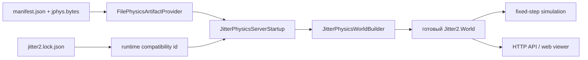

# Тестовый сервер и проверка загрузки артефактов

## Короткий ответ

Да, в проекте есть запускаемый тестовый сервер:
`Server/JitterPhysicsWebViewer/`. Это самостоятельное приложение `.NET 10` на ASP.NET Core,
которое не зависит от Unity. Оно:

1. читает экспортированные manifest и binary payload;
2. проверяет их целостность и совместимость с текущей сборкой Jitter2;
3. строит статическую геометрию в настоящем `Jitter2.World` тем же loader-ом, который
   использует Unity-клиент;
4. запускает fixed-step симуляцию;
5. отдаёт состояние и простую three.js-визуализацию через HTTP.

Это демонстрационный dedicated-server и end-to-end smoke fixture, а не сервер матча EFT:
здесь нет Netick, подключения игроков, prediction/reconciliation и connection approval.
Production-интеграция должна встроить package runtime в настоящий match server.

## Что относится к серверной проверке

| Путь | Назначение |
| --- | --- |
| `Server/JitterPhysicsWebViewer/` | Запускаемый ASP.NET Core сервер и web viewer |
| `Server/tools/GenerateSampleArtifact/` | Headless-генератор демонстрационных артефактов без Unity |
| `Server/demo-levels.json` | Общее описание четырёх demo-сцен и их seed-артефактов |
| `Server/artifacts/` | Временная delivery-папка manifest/payload; игнорируется Git |
| `Packages/com.datasakura.jitter-physics-baker/Server~/Tests/` | `.NET 10`-тесты codec, provider, startup и world builder; это не отдельный сервер |
| `Packages/com.datasakura.jitter-physics-baker/Server~/README.md` | Модель встраивания loader-а в сервер потребителя |

## Как проходит запуск уровня



При старте `Program` находит один manifest через `--manifest` либо все manifests в папке
`--artifacts`. Если параметры не переданы, приложение ищет `Server/artifacts/` вверх от
своего output-каталога.

Для каждого manifest создаётся отдельный `Jitter2.World`, после чего:

1. `JitterLock` читает скопированный рядом с executable `jitter2.lock.json` и вычисляет
   runtime compatibility id из package version, хэша исходников Jitter2 и compile profile.
2. `FilePhysicsArtifactProvider` читает manifest. Имя payload обязано быть простым именем
   файла: абсолютные пути и `../` отклоняются.
3. Provider читает payload, проверяет лимит размера и SHA-256, декодирует binary format,
   валидирует данные и сверяет поля payload с manifest.
4. `JitterPhysicsServerStartup` проверяет runtime compatibility id и вызывает общий
   `JitterPhysicsWorldBuilder`.
5. Builder применяет настройки мира, создаёт статические тела и shapes строго в порядке
   артефакта и вычисляет `topologyFingerprint`. При ошибке созданные тела удаляются.
6. Только после успешной загрузки **всех** найденных уровней открывается HTTP-порт. При
   ошибке хотя бы одного уровня процесс завершается с ненулевым кодом.
7. Для каждого уровня запускается отдельный однопоточный fixed-step loop с tick rate из
   артефакта. HTTP-команды spawn/reset выполняются на simulation thread между шагами.

Успешный startup печатает строку, пригодную для smoke-проверки:

```text
[JitterPhysics] physics self-check OK level=demo_arena artifact=... topology=... bodies=... shapes=... triangles=... tickRate=60 elapsedMs=...
```

Важно: общий `JitterPhysicsServerStartup` умеет проверять ожидаемые `levelId` и tick rate,
но текущий web viewer передаёт `expectedLevelId: null` и `tickRate: 0`. Поэтому viewer
принимает эти значения из артефакта; строгая проверка launcher configuration покрыта
автоматическими тестами, но пока не вынесена в CLI web viewer-а.

## Быстрая автоматическая проверка

Из корня репозитория:

```sh
bash "Packages/com.datasakura.jitter-physics-baker/tools~/test-dotnet.sh" --nologo -v minimal
dotnet build Server/JitterPhysicsWebViewer/JitterPhysicsWebViewer.csproj --nologo
```

Первый запуск проверяет portable codec и contracts, file/embedded providers, Jitter2 snapshot,
fail-fast startup, создание static topology и фактическую коллизию динамического тела с
запечённым полом. Второй доказывает, что само ASP.NET-приложение компилируется с теми же
package sources и prebuilt `Jitter2.Core.dll`.

Эти команды не заменяют четыре обязательные проверки из корневого `AGENTS.md`; перед
коммитом нужно запускать весь указанный там набор.

## End-to-end проверка без Unity

### 1. Подготовить seed-артефакты

Чтобы не перезаписывать артефакты, экспортированные из Unity, удобно использовать временную
папку:

```sh
server_artifacts="$(mktemp -d)"
dotnet run --project Server/tools/GenerateSampleArtifact -- "$server_artifacts"
```

Ожидаемо: генератор сообщает пять уровней, размеры, counts, короткие SHA-256 и общий runtime
id. Seed-файлы созданы package writer-ом и подходят для smoke/CI, но источником истины для
реального уровня остаётся bake в Unity.

`server_artifacts` — обычная shell-переменная: она существует только в терминале, где была
назначена. В новом терминале её нужно назначить повторно либо передать явный путь к папке.

### 2. Запустить сервер

Если использовалась временная папка из предыдущего шага, в **том же терминале**:

```sh
dotnet run --project Server/JitterPhysicsWebViewer -- \
  --artifacts "$server_artifacts" \
  --urls http://127.0.0.1:5087
```

Если артефакты уже экспортированы из Unity в `Server/artifacts/`, параметр не нужен: viewer
сам найдёт стандартную папку от своего output-каталога.

```sh
dotnet run --project Server/JitterPhysicsWebViewer -- \
  --urls http://127.0.0.1:5087
```

Для другой папки передавать абсолютный путь. Относительный путь вычисляется от content root
приложения, которым при `dotnet run --project` является `Server/JitterPhysicsWebViewer/`.

Ожидаемо:

- по одной строке `physics self-check OK` для каждого уровня;
- затем `Now listening on: http://127.0.0.1:5087`;
- ни одного уровня со строкой `FAILED`.

Процесс работает до `Ctrl+C`.

### 3. Проверить API

Во втором терминале:

```sh
curl --fail --silent http://127.0.0.1:5087/api/levels
curl --fail --silent http://127.0.0.1:5087/api/status/demo_arena
curl --fail --silent \
  -X POST "http://127.0.0.1:5087/api/spawn/demo_arena?type=sphere&count=1"
curl --fail --silent http://127.0.0.1:5087/api/state/demo_arena
```

Проверять нужно следующее:

- `/api/levels` возвращает каталог уровней с hash, topology fingerprint и counts;
- `/api/status/demo_arena` содержит `physics self-check OK`, полный artifact hash, runtime
  compatibility id и сведения о Jitter lock;
- spawn отвечает HTTP `202 Accepted`;
- в `/api/state/demo_arena` растёт `tick`, а в `bodies` появляются динамические тела.

Полный API:

| Метод и route | Назначение |
| --- | --- |
| `GET /api/levels` | Каталог загруженных уровней |
| `GET /api/status/{id}` | Startup/self-check, identity и counts уровня |
| `GET /api/level/{id}` | Неизменяемая статическая геометрия для viewer-а |
| `GET /api/state/{id}` | Текущий tick и динамические тела |
| `POST /api/spawn/{id}?type=sphere\|box&count=N` | Добавить тела; count ограничивается диапазоном 1–25 |
| `POST /api/reset/{id}` | Удалить динамические тела, не трогая static world |

### 4. Проверить web viewer

Открыть `http://127.0.0.1:5087` в браузере, переключить несколько уровней, нажать
`Drop 10 spheres`, `Drop 10 boxes` и `Clear dynamic bodies`.

Ожидаемо: тела падают и остаются на запечённой геометрии; reset удаляет только динамические
тела. Страница загружает three.js с `unpkg.com`, поэтому для визуальной части нужен доступ в
интернет. Сам сервер и HTTP API работают без него.

### 5. Проверить fail-fast

При остановленном сервере:

```sh
dotnet run --project Server/JitterPhysicsWebViewer -- \
  --manifest /tmp/absent-level.manifest.json
```

Ожидаемо: `physics self-check FAILED`, сообщение `Refusing to serve` и ненулевой exit code;
HTTP-порт не открывается. Подмена bytes, hash, schema, runtime id, level id или tick rate
подробнее и безопаснее проверяется тестами в `Server~/Tests`.

## Проверка настоящего Unity-артефакта

Seed-генератор доказывает headless pipeline, но основной сценарий должен пройти с точными
байтами Unity bake:

1. Установить Jitter2 и integration через
   `Tools > DataSakura > Jitter Physics > Setup`.
2. Выполнить `Tools > DataSakura > Jitter Physics > Demo > Bake All Demo Scenes` либо
   запечь нужную authoring-сцену обычной командой baker-а.
3. В окне Jitter Physics выбрать артефакт и нажать
   `Export payload and manifest...`.
4. Выбрать отдельную пустую папку. Экспорт копирует уже запечённые bytes и manifest, не
   выполняя скрытый rebake.
5. Запустить viewer с `--artifacts <эта папка>` либо с
   `--manifest <путь к одному .manifest.json>`.
6. Сверить полный `artifactHash` из `/api/status/{id}` с hash Unity-артефакта и убедиться,
   что self-check успешен.

Для строгого доказательства паритета Unity ↔ `.NET` дополнительно выполнить MT-27 и MT-28
из `MANUAL_TEST_PLAN.md`: topology fingerprint, полученный в Unity, должен символ в символ
совпасть с fingerprint сервера для тех же exact bytes.

## Что именно доказывают проверки

| Проверка | Что доказывает | Чего не доказывает |
| --- | --- | --- |
| `test-dotnet.sh` | Portable source компилируется вне Unity; ошибки доставки отклоняются; builder создаёт рабочую topology | Работу UI и конкретного экспортированного файла |
| Сборка web viewer | Demo server совместим с текущим package/Jitter assembly | Успешный startup с артефактом |
| API smoke с seed | Полный путь file → validation → world → step → HTTP | Паритет с конкретным Unity bake |
| Smoke с Unity export | Сервер принимает точные bytes Unity и строит мир | Netick/матчевую интеграцию |
| MT-27/MT-28 | Совпадение static topology Unity и `.NET` | Долгую deterministic simulation/reconciliation |

## Текущие границы решения

- `Server/artifacts/` игнорируется Git; на чистом checkout артефакты нужно сгенерировать или
  экспортировать заново.
- Web viewer автоматически создаёт динамические тела для демонстрации. Package loader сам
  не владеет tick loop и не создаёт gameplay bodies.
- Каждый уровень живёт в отдельном `Jitter2.World`; hot reload артефакта в существующий мир
  намеренно запрещён.
- Viewer не реализует `--level`/`--tick-rate`; эти expectations нужно передать в
  `JitterPhysicsServerOptions` при интеграции с настоящим launcher-ом.
- Это не подтверждение EFT/Netick integration и не production load/performance test.
